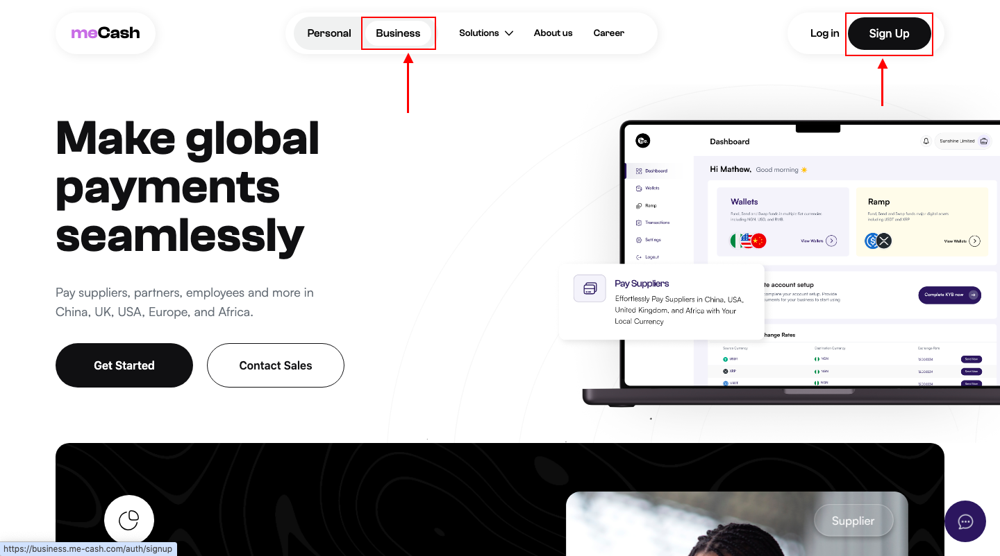
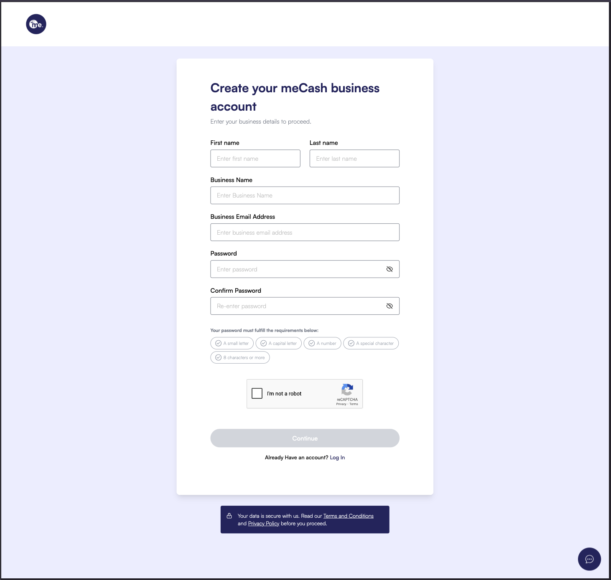
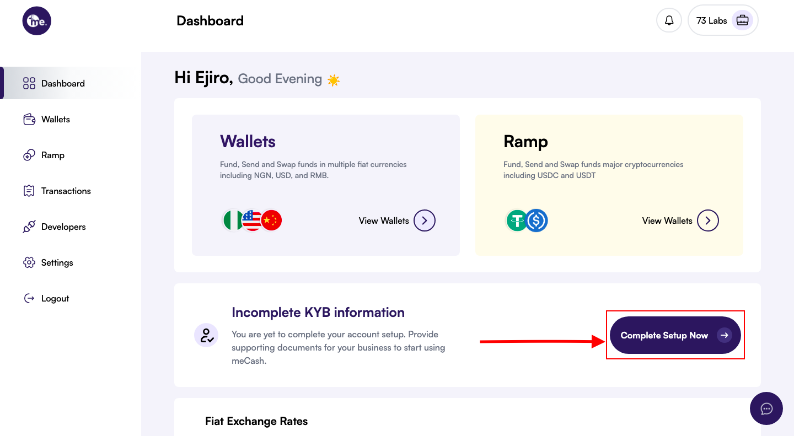
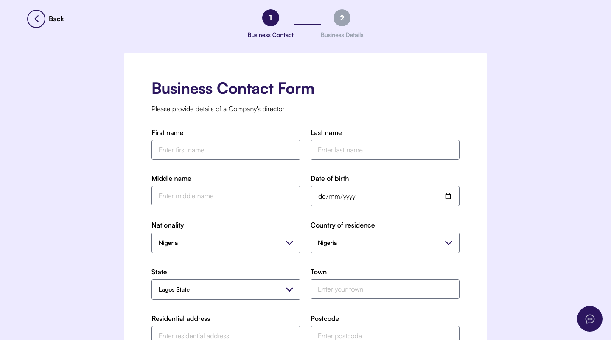
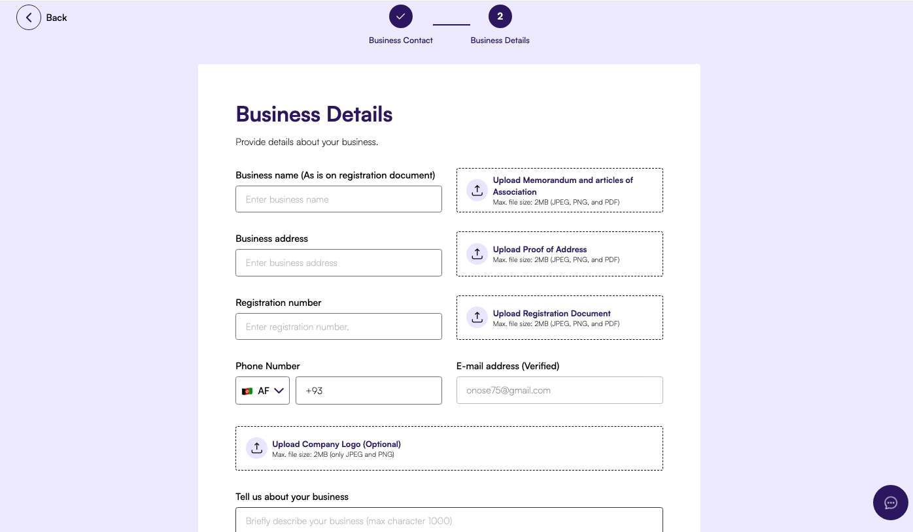

Before you can authenticate with the meCash API, you need a verified business workspace. Follow these steps to set up your account and complete KYB (Know Your Business) verification.

## Create your business account
<AccordionGroup>
  <Accordion icon="user-plus" title="1. Open the Business sign-up page">
    <Frame>
      
    </Frame>

    1. Visit the [meCash Business portal](https://business.me-cash.com).
    2. Choose the **Business** option and click **Sign Up**.
    3. Continue to the account creation form.

  </Accordion>
  <Accordion icon="id-card" title="2. Complete the registration form">
    <Frame>
      
    </Frame>
    Provide the required business details:
    - First and last name  
    - Business name and business email  
    - Secure password (confirm it before submitting)
    Click **Continue** to submit your registration.
  </Accordion>

  <Accordion icon="envelope" title="3. Verify your email address">
    Look for a verification email from meCash and click the confirmation link to activate your account. You cannot continue until this step is complete.
  </Accordion>

</AccordionGroup>
## Complete KYB verification
<AccordionGroup>
  <Accordion icon="shield-check" title="1. Launch the KYB workflow">
    <Frame>
      
    </Frame>

    1. Sign in to your dashboard.  
    2. Open the **KYB Verification** tile.  
    3. Click **Complete Setup Now** to start the review process.
  </Accordion>

  <Accordion icon="user" title="2. Fill in business contact information">
    <Frame>
      
    </Frame>
    Enter accurate personal and business details. The director’s first and last name must exactly match the information associated with their BVN.
  </Accordion>
  <Accordion icon="file-arrow-up" title="3. Upload verification documents">
    <Frame>
      
    </Frame>

    Attach the required documentation:
    - Business registration certificate  
    - Valid government-issued ID  
    - Proof of address
    Submit the KYB application when every field is complete.
  </Accordion>

  <Accordion icon="circle-check" title="4. Wait for approval">
    Our compliance team will review your submission and notify you by email once the account is verified. You can track the status from the dashboard.
  </Accordion>
</AccordionGroup>
<Tip>
  Need to update your documents? You can revisit the KYB flow from the dashboard at any time before approval.
</Tip>

## Next steps
Once verification is complete, you can [generate your API keys](/authentication) and begin testing endpoints in the [Quickstart guide](/quickstart).
