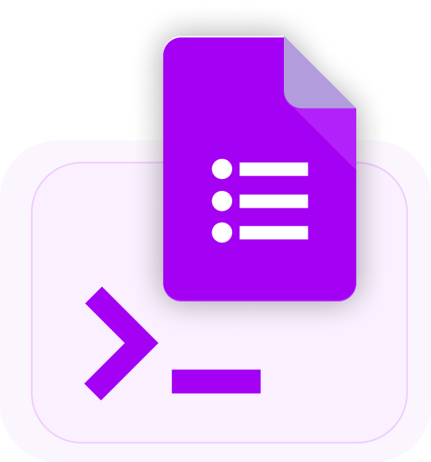
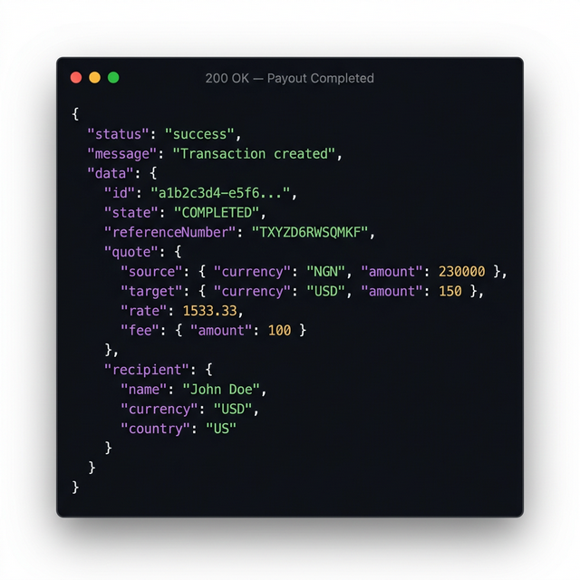

  <section className="hero-gradient">
    

      meCash Developer Hub
      <h1 className="hero-title" style={{ color: '#000000' }}>
        Make global payouts, wallets, and collections faster.
      </h1>
      

        Build real-time money movement into your product with clear guides, OpenAPI references,
        and prebuilt examples. Move from sandbox to production-ready integrations in hours, not weeks.
      

      

        <a className="hero-primary" href="/quickstart">
          Let's get started
        </a>
        <a className="hero-secondary" href="/api-reference/introduction">
          Explore API Reference
        </a>
      

    

    

      
    

  </section>

  {/* ── TRUSTED METRICS ── */}
  <section style={{ borderTop: '1px solid var(--border-color, #e5e7eb)', borderBottom: '1px solid var(--border-color, #e5e7eb)', background: 'var(--bg-muted, rgba(0,0,0,0.02))', borderRadius: '16px', padding: '2rem 2.5rem' }}>
    

      

        
150+

        
Payout Corridors

      

      

        
REST

        
API Architecture

      

      

        
⚡ Fast

        
Reliable Webhooks

      

      

        
99.9%

        
Uptime SLA

      

    

  </section>

  <section>
    <h2 className="section-title centered">
      Navigate the Docs
    </h2>
    <CardGroup cols={4}>
      <Card title="Getting Started" icon="rocket" href="/quickstart">
        Create your workspace, secure your credentials, and verify IPs before your first request.
      </Card>
      <Card title="Documentation" icon="book" href="/documentation-overview">
        Learn how wallets, quotes, payouts, and virtual accounts work together across flows.
      </Card>
      <Card title="API Reference" icon="code" href="/api-reference/introduction">
        Browse every endpoint schema, test requests in the playground, and grab ready-made examples.
      </Card>
      <Card title="Resources" icon="lightbulb" href="/faq">
        Tap into FAQs, troubleshooting guides, and support channels whenever you need assistance.
      </Card>
    </CardGroup>
  </section>

  {/* ── API PREVIEW ── */}
  <section style={{ background: 'var(--bg-muted, rgba(0,0,0,0.02))', border: '1px solid var(--border-color, #e5e7eb)', borderRadius: '20px', padding: '2.5rem 3rem' }}>
    

      

        
        Quick Integration
      

      

        

          <h2 style={{ fontSize: '1.75rem', fontWeight: '700', margin: '0 0 1rem' }}>Ship in hours, not weeks.</h2>
          

            A clean REST API with predictable responses, real code examples in 12+ languages, and a sandbox you can hit immediately.
          

          

            

              ✅
              

                
Instant Sandbox Access

                
Test every endpoint with zero risk before going live.

              

            

            

              ✅
              

                
Webhook-First Architecture

                
Real-time notifications for every state change.

              

            

            

              ✅
              

                
Interactive Playground

                
Try requests directly from the docs — no Postman needed.

              

            

          

        

        

          
        

      

    

  </section>

  <section>
    <h2 className="section-title centered">
      Launch a Use Case
    </h2>
    <CardGroup cols={2}>
      <Card title="Manage Wallets" icon="wallet" href="/wallet-docs/wallet-overview">
        Issue and monitor multi-currency wallets, sync balances, and reconcile funds across regions.
      </Card>
      <Card title="Lock in Rates" icon="calculator" href="/quote-docs/about-quote">
        Generate guaranteed quotes with fee transparency and corridor-specific compliance rules.
      </Card>
      <Card title="Send Payouts" icon="money-bill-transfer" href="/payout-docs/payout">
        Orchestrate bank transfers and mobile money payouts with detailed, corridor-specific recipes.
      </Card>
      <Card
        title="Collect via Virtual Accounts"
        icon="building-columns"
        href="/virtual-accounts-docs/about-virtual-account"
      >
        Spin up static or dynamic collection accounts, automate notifications, and reconcile deposits seamlessly.
      </Card>
      <Card title="Bulk Payouts" icon="users" href="/payout-docs/bulk-payout">
        Disburse funds to multiple beneficiaries in a single request, manage batch results, and automate high-volume transfers.
      </Card>
    </CardGroup>
  </section>

<section>
    <h2 className="section-title centered">
      Need a Hand?
    </h2>
    <CardGroup cols={2}>
      <Card
        title="Request a Demo"
        icon="calendar"
        href="/request-demo"
      >
        Book a personalized walkthrough with our product experts to explore payouts and collections.
      </Card>
      <Card
        title="Join the Community"
        icon="discord"
        href="https://discord.com/invite/CC5v6h52Wk"
      >
        Chat with the meCash team and other builders in our Discord server for quick tips and support.
      </Card>
      <Card
        title="Follow Updates on X"
        icon="twitter"
        href="https://x.com/mecash14"
      >
        Stay in the loop on releases, maintenance windows, and product highlights directly on X (Twitter).
      </Card>
      <Card
        title="Email Support"
        icon="envelope"
        href="mailto:support@me-cash.com"
      >
        Prefer email? Reach the support team anytime at support@me-cash.com for tailored assistance.
      </Card>
    </CardGroup>
  </section>

  {/* Biel.ai widget (global on homepage) */}
  

    <link
      rel="stylesheet"
      href="https://cdn.jsdelivr.net/npm/biel-search/dist/biel-search/biel-search.css"
    />
    <script
      type="module"
      src="https://cdn.jsdelivr.net/npm/biel-search/dist/biel-search/biel-search.esm.js"
    />
  

  <biel-button
    project="xvqjfh6ecf"
    header-title="Biel.ai Chatbot"
    button-position="bottom-right"
    modal-position="sidebar-right"
    button-style="dark"
  >
    Ask AI
  </biel-button>

