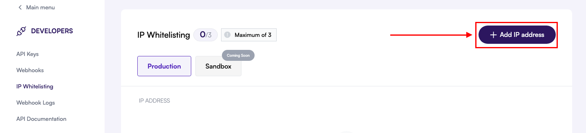

To use the meCash API, you must first add at least one trusted IP address. Requests coming from non-whitelisted sources are rejected automatically, keeping your integration secure.

## What happens if an IP isn’t whitelisted?

```json "403 Forbidden"
{
  "message": "Forbidden: Your IP address is not whitelisted to access this resource."
}
```

Your API keys remain inactive until a valid IP is on the list, so complete this step before attempting live calls.

## Add an IP address

<AccordionGroup>
  <Accordion icon="compass-drafting" title="1. Open the Developers area">
    <Frame>
      
    </Frame>

    Log in to the meCash dashboard and select **Developers** from the sidebar.
  </Accordion>

  <Accordion icon="shield-check" title="2. Switch to the IP Whitelisting tab">
    In the Developers workspace, open **IP Whitelisting** to view existing addresses and available actions.
  </Accordion>

  <Accordion icon="plus" title="3. Add a new IP address">
    <Frame>
      
    </Frame>

    Click **Add IP Address** to launch the entry form.
  </Accordion>

  <Accordion icon="keyboard" title="4. Enter the IP and confirm">
    <Frame>
      
    </Frame>

    Provide the static IP of your server, then click **Confirm**. The address appears in the list with its current status.
  </Accordion>
</AccordionGroup>

<Tip>
  Prefer static IPs. Update the whitelist immediately if your infrastructure’s public IP changes.
</Tip>
