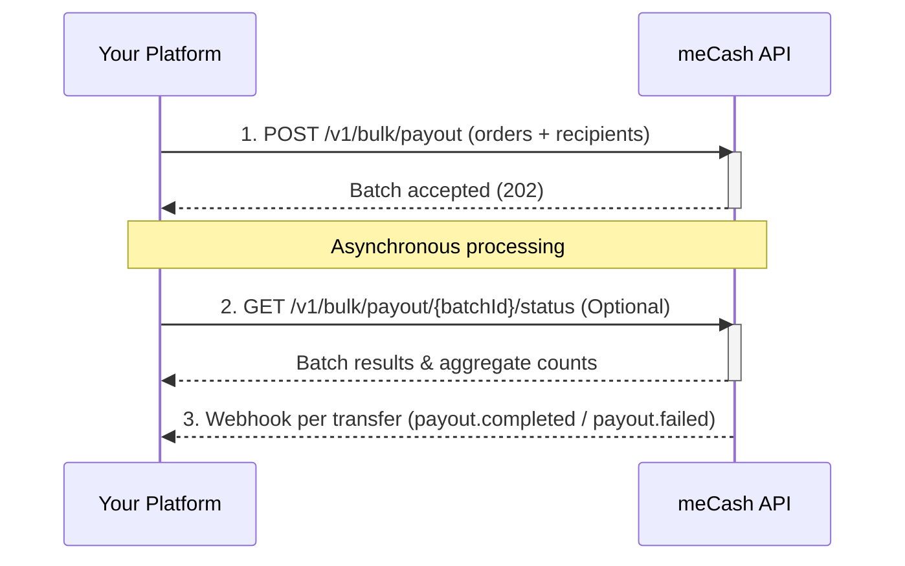

The **meCash Bulk Payout API** lets you disburse funds to multiple beneficiaries in a single API request. Instead of sending individual transfer requests, you submit a batch of payout orders — ideal for payroll, vendor payments, commissions, and mass disbursements.

<Tip>Each order within a bulk payout is processed independently. If one transfer fails validation, the remaining valid transfers still execute.</Tip>

## Bulk payout lifecycle



## How it works

<Steps>
### Step 1: Submit bulk payout

Send all payout orders in one request to `POST /v1/bulk/payout`. Each item includes a unique `referenceNumber`, amount, reason, and full recipient bank details.

<Tabs>
  <Tab title="Request">
    ```bash cURL
    curl --location 'https://devapi.me-cash.com/v1/bulk/payout' \
    --header 'Content-Type: application/json' \
    --header 'x-api-key: YOUR_API_KEY' \
    --data '{
        "items": [
            {
                "referenceNumber": "REF_ZZOEAZH8ZJI6",
                "targetAmount": "1500",
                "reason": "Salary payment",
                "recipient": {
                    "name": "NNOROM UZOMA CHUKWUDI",
                    "account": {
                        "bankName": "FCMB",
                        "sortCode": "214",
                        "accountNumber": "2483520014"
                    },
                    "paymentChannel": "BANK_TRANSFER",
                    "currency": "NGN",
                    "country": "NG"
                }
            },
            {
                "referenceNumber": "REF_DZNGDNK5FFGH",
                "targetAmount": "2500",
                "reason": "Salary payment",
                "recipient": {
                    "name": "NNOROM UZOMA CHUKWUDI",
                    "account": {
                        "bankName": "FCMB",
                        "sortCode": "214",
                        "accountNumber": "2483520014"
                    },
                    "paymentChannel": "BANK_TRANSFER",
                    "currency": "NGN",
                    "country": "NG"
                }
            },
            {
                "referenceNumber": "REF_YMSVIDEXJX1Y",
                "targetAmount": "3600",
                "reason": "Salary payment",
                "recipient": {
                    "name": "NNOROM UZOMA CHUKWUDI",
                    "account": {
                        "bankName": "FCMB",
                        "sortCode": "214",
                        "accountNumber": "2483520014"
                    },
                    "paymentChannel": "BANK_TRANSFER",
                    "currency": "NGN",
                    "country": "NG"
                }
            }
        ],
        "source": {
            "currency": "NGN",
            "country": "NG"
        },
        "target": {
            "currency": "NGN",
            "country": "NG"
        },
        "paymentChannel": "BANK_TRANSFER",
        "remark": "June 2026 Salary"
    }'
    ```
  </Tab>
  <Tab title="Response (202)">
    ```json copy
    {
        "message": "Batch Created",
        "status": "success",
        "data": {
            "batchId": "44cbef79-3b95-4214-bda2-xxxxxxxxxxxx",
            "referenceNo": "KJ5CFZ0YMWJC7",
            "timestamp": "2026-04-08T17:35:54.114741545Z",
            "batchTotal": 15,
            "totalSuccessful": 0,
            "totalFailed": 0,
            "totalPending": 15
        }
    }
    ```
  </Tab>
</Tabs>

<Info>
  A `202 Accepted` response means the batch has been **queued** — not yet processed. Orders are settled asynchronously. Listen for [`payout.completed`](/webhook/payout-webhook) and [`payout.failed`](/webhook/payout-webhook) webhooks to track individual transfer outcomes.
</Info>

### Step 2: Check batch status (Optional)

Poll for results using the `batchId` returned from Step 1. This is useful if you want to check overall progress without waiting for individual webhooks.

<Tabs>
  <Tab title="Request">
    ```bash cURL
    curl --location 'https://devapi.me-cash.com/v1/bulk/payout/{{batchId}}/status' \
    --header 'Content-Type: application/json' \
    --header 'x-api-key: YOUR_API_KEY'
    ```
  </Tab>
  <Tab title="Response (200)">
    ```json copy
    {
        "message": "Transaction Processing",
        "status": "success",
        "data": {
            "state": "pending",
            "batchId": "44cbef79-3b95-4214-bda2-78014f400d11",
            "startTimestamp": "2026-04-08T17:35:54.070396Z",
            "endTimestamp": null,
            "batchTotal": 15,
            "totalSuccessful": 0,
            "totalFailed": 0,
            "totalPending": 15,
            "items": [
                {
                    "referenceNumber": "REF_ZZOEAZH8ZJI6",
                    "status": "pending",
                    "targetAmount": "1500",
                    "reason": "Salary payment",
                    "recipient": {
                        "id": "f55914fe-0568-473d-bf6f-95c32c71094e",
                        "name": "NNOROM UZOMA CHUKWUDI",
                        "account": {
                            "bankName": "FCMB",
                            "sortCode": "214",
                            "accountNumber": "2483520014"
                        },
                        "paymentChannel": "BANK_TRANSFER",
                        "currency": "NGN",
                        "country": "NG"
                    }
                }
            ],
            "source": { "currency": "NGN", "country": "NG" },
            "target": { "currency": "NGN", "country": "NG" },
            "paymentChannel": "BANK_TRANSFER",
            "remark": "June 2026 Salary"
        }
    }
    ```
  </Tab>
</Tabs>

### Step 3: Listen for webhooks

Every individual payout in the batch triggers its own separate webhook — so a batch with 15 orders will fire **15 individual webhook events**. Each webhook is either [`payout.completed`](/webhook/payout-webhook) or [`payout.failed`](/webhook/payout-webhook), depending on the outcome of that specific transfer.

Use the `referenceNumber` from each order to correlate incoming webhook events with specific transfers in your system.

<Warning>
  Your webhook endpoint must be able to handle **multiple concurrent deliveries**. For a large batch, many webhooks may arrive in quick succession as transfers are settled.
</Warning>

See [Webhook Signature Verification](/webhook/webhooks-signature-verification) to secure your endpoint.

</Steps>

## Request body breakdown

| **Field** | **Type** | **Required** | **Description** |
|-----------|----------|:------------:|-----------------|
| `items` | Array | ✅ | List of individual payout orders (see below). |
| `items[].referenceNumber` | String | ✅ | Your unique reference for this specific order. |
| `items[].targetAmount` | String | ✅ | Amount to send to the recipient. |
| `items[].reason` | String | ✅ | Purpose of the transfer (e.g. `Salary payment`). |
| `items[].recipient.name` | String | ✅ | Full name of the recipient. |
| `items[].recipient.account.bankName` | String | ✅ | Name of the recipient's bank. |
| `items[].recipient.account.sortCode` | String | ✅ | Bank sort code / bank code. |
| `items[].recipient.account.accountNumber` | String | ✅ | Recipient's bank account number. |
| `items[].recipient.paymentChannel` | String | ✅ | Payment method (e.g. `BANK_TRANSFER`). |
| `items[].recipient.currency` | String | ✅ | Target currency code (e.g. `NGN`). |
| `items[].recipient.country` | String | ✅ | Target country code (e.g. `NG`). |
| `source.currency` | String | ✅ | Source wallet currency. |
| `source.country` | String | ✅ | Source wallet country. |
| `target.currency` | String | ✅ | Destination currency. |
| `target.country` | String | ✅ | Destination country. |
| `paymentChannel` | String | ✅ | Top-level payment channel for the batch. |
| `remark` | String | ❌ | A general note for the entire batch submission. |

## Response breakdown

| **Field** | **Type** | **Description** |
|-----------|----------|-----------------|
| `message` | String | Confirmation message from the API. |
| `status` | String | Overall request status (`success` or `failed`). |
| `data.state` | String | The processing state of the batch (e.g. `pending`, `completed`). |
| `data.batchId` | String | Unique identifier for the batch submission. |
| `data.startTimestamp`| String | ISO 8601 timestamp of when processing began. |
| `data.endTimestamp` | String | ISO 8601 timestamp of when processing finished (`null` if pending). |
| `data.batchTotal` | Number | Total number of payout orders in the batch. |
| `data.totalSuccessful`| Number | Total orders that have reached a final success state. |
| `data.totalFailed` | Number | Total orders that have failed processing. |
| `data.totalPending` | Number | Total orders still in the queue or being processed. |
| `data.items` | Array | A list of all individual payout orders and their specific statuses. |

## Key behaviors

| Behavior | Description |
|----------|-------------|
| **Independent processing** | Each transfer is validated and processed separately. A single failure does not block other orders. |
| **Balance pre-check** | The system validates that your wallet balance covers the total amount plus all fees before processing any orders. |
| **Individual transaction records** | Every order generates its own `referenceNumber`. Use the [Get Transaction API](/transaction-docs/get-transaction) to fetch full traceability details. |
| **Rate limits** | The bulk endpoint enforces payload size limits. Contact support for your account's maximum orders per request. |
| **Audit trail** | Both the bulk request reference and individual transaction references are logged for compliance and reconciliation. |

## Use cases

<CardGroup cols={3}>
  <Card title="Payroll" icon="money-bill-wave">
    Disburse salaries to all employees in one API call instead of hundreds of individual transfers.
  </Card>
  <Card title="Vendor Payments" icon="store">
    Pay multiple suppliers and vendors across different banks simultaneously.
  </Card>
  <Card title="Commission Payouts" icon="hand-holding-dollar">
    Distribute commissions or rewards to agents, affiliates, or partners at once.
  </Card>
</CardGroup>

## Next steps

<CardGroup cols={3}>
  <Card title="Create Bulk Payout API" icon="paper-plane" href="/payout/create-bulk-payout">
    Full OpenAPI reference for `POST /v1/bulk/payout`.
  </Card>
  <Card title="Fetch Batch Status API" icon="search" href="/payout/get-batch-status">
    Check processing status via `GET /v1/bulk/payout/{batchId}/status`.
  </Card>
  <Card title="Single Payout Guide" icon="arrow-right" href="/payout-docs/payout">
    Need to send to just one recipient? Use the standard payout flow.
  </Card>
</CardGroup>
