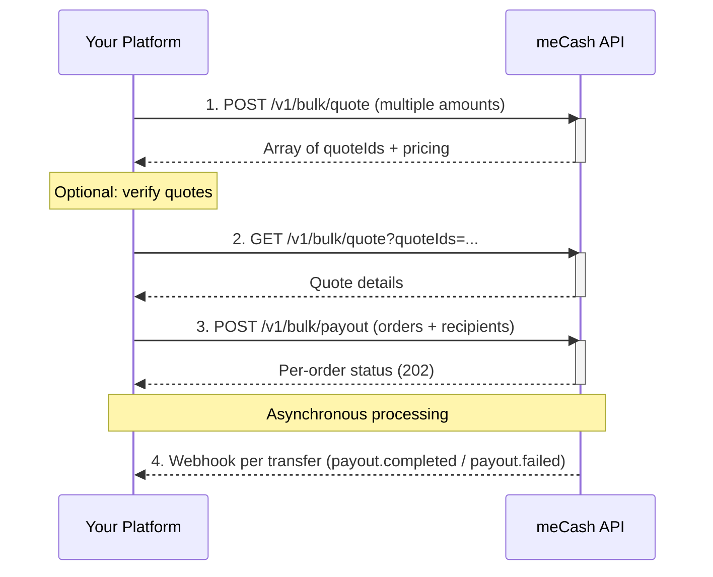

The **meCash Bulk Payout API** lets you disburse funds to multiple beneficiaries in a single API request. Instead of sending individual transfer requests, you submit a batch of payout orders — ideal for payroll, vendor payments, commissions, and mass disbursements.

<Tip>Each order within a bulk payout is processed independently. If one transfer fails validation, the remaining valid transfers still execute.</Tip>

## Bulk payout lifecycle



## How it works

<Steps>
### Step 1: Create a bulk quote

Send all transfer amounts in a single request to `POST /v1/bulk/quote`. Each item receives its own `quoteId` with independent pricing, fees, and expiry.

```bash cURL
curl --request POST 'https://devapi.me-cash.com/v1/bulk/quote' \
  --header 'Content-Type: application/json' \
  --header 'x-api-key: YOUR_API_KEY' \
  --data '{
    "paymentChannel": "BANK_TRANSFER",
    "items": [
        { "sourceAmount": 100.00 },
        { "sourceAmount": 250.50 }
    ],
    "source": { "currency": "NGN", "country": "NG" },
    "target": { "currency": "NGN", "country": "NG" }
}'
```

### Step 2: Fetch quotes (optional)

Retrieve one or more quotes by their IDs to confirm pricing before executing. Pass multiple `quoteIds` as query parameters.

```bash cURL
curl --request GET 'https://devapi.me-cash.com/v1/bulk/quote?quoteIds=fa01c1ad-6c0f-4074-8221-ffc8fdaa16db&quoteIds=6809b2ab-1d4d-4436-8218-46667419eee7' \
  --header 'Content-Type: application/json' \
  --header 'x-api-key: YOUR_API_KEY'
```

### Step 3: Submit bulk payout

Send all payout orders in one request to `POST /v1/bulk/payout`. Each order pairs a `quoteId` with recipient bank details.

```bash cURL
curl --request POST 'https://devapi.me-cash.com/v1/bulk/payout' \
  --header 'Content-Type: application/json' \
  --header 'x-api-key: YOUR_API_KEY' \
  --data '{
    "orders": [
        {
            "quoteId": "b70f6798-ae5c-41fd-92c9-d6cfc325b8dc",
            "recipient": {
                "id": "a5b60e98-90b2-4fd6-95b6-13dadc51467f",
                "name": "NNOROM UZOMA CHUKWUDI",
                "account": {
                    "bankName": "FCMB",
                    "sortCode": "214",
                    "accountNumber": "2483520014"
                },
                "paymentChannel": "BANK_TRANSFER",
                "currency": "NGN",
                "country": "NG"
            },
            "remark": "payment 1",
            "reason": "Gift"
        },
        {
            "quoteId": "faeafe20-d5c8-47b5-913a-2c81d15a69cb",
            "recipient": {
                "id": "a5b60e98-90b2-4fd6-95b6-13dadc51467f",
                "name": "NNOROM UZOMA CHUKWUDI",
                "account": {
                    "bankName": "FCMB",
                    "sortCode": "214",
                    "accountNumber": "2483520014"
                },
                "paymentChannel": "BANK_TRANSFER",
                "currency": "NGN",
                "country": "NG"
            },
            "remark": "payment 2",
            "reason": "Gift"
        }
    ]
}'
```

### Step 4: Listen for webhooks

Each individual transfer triggers its own webhook (`payout.completed` or `payout.failed`). Use the `transactionId` from the bulk payout response to correlate webhook events with specific orders.

</Steps>

## Key behaviors

| Behavior | Description |
|----------|-------------|
| **Independent processing** | Each transfer is validated and processed separately. A single failure does not block other orders. |
| **Balance pre-check** | The system validates that your wallet balance covers the total amount plus all fees before processing any orders. |
| **Individual transaction records** | Every order generates its own `transactionId` and transaction record for full traceability. |
| **Quote expiry** | Bulk quotes expire after 10 minutes. Submit your payout promptly after quoting. |
| **Rate limits** | The bulk endpoint enforces payload size limits. Contact support for your account's maximum orders per request. |
| **Audit trail** | Both the bulk request reference and individual transaction references are logged for compliance and reconciliation. |

## Use cases

<CardGroup cols={3}>
  <Card title="Payroll" icon="money-bill-wave">
    Disburse salaries to all employees in one API call instead of hundreds of individual transfers.
  </Card>
  <Card title="Vendor Payments" icon="store">
    Pay multiple suppliers and vendors across different banks simultaneously.
  </Card>
  <Card title="Commission Payouts" icon="hand-holding-dollar">
    Distribute commissions or rewards to agents, affiliates, or partners at once.
  </Card>
</CardGroup>

## Next steps

<CardGroup cols={2}>
  <Card title="Create Bulk Quote API" icon="code" href="/payout/create-bulk-quote">
    Full OpenAPI reference for `POST /v1/bulk/quote`.
  </Card>
  <Card title="Fetch Bulk Quotes API" icon="search" href="/payout/get-bulk-quotes">
    Retrieve existing quotes via `GET /v1/bulk/quote`.
  </Card>
  <Card title="Create Bulk Payout API" icon="paper-plane" href="/payout/create-bulk-payout">
    Full OpenAPI reference for `POST /v1/bulk/payout`.
  </Card>
  <Card title="Single Payout Guide" icon="arrow-right" href="/payout-docs/payout">
    Need to send to just one recipient? Use the standard payout flow.
  </Card>
</CardGroup>
