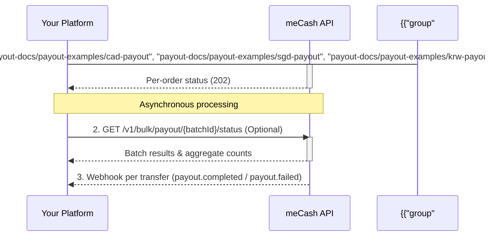

<Info>This API is still under construction.</Info>

The **meCash Bulk Payout API** lets you disburse funds to multiple beneficiaries in a single API request. Instead of sending individual transfer requests, you submit a batch of payout orders — ideal for payroll, vendor payments, commissions, and mass disbursements.

<Tip>Each order within a bulk payout is processed independently. If one transfer fails validation, the remaining valid transfers still execute.</Tip>

## Bulk payout lifecycle



## How it works

<Steps>
### Step 1: Submit bulk payout

Send all payout orders in one request to `POST /v1/bulk/payout`. Each order pairs a `quoteId` with recipient bank details.

```bash cURL
curl --location 'https://devapi.me-cash.com/v1/bulk/payout' \
--header 'Content-Type: application/json' \
--header 'x-api-key: YOUR_API_KEY' \
--data '{
    "items": [
        {
            "referenceNumber": "REF_ZZOEAZH8ZJI6",
            "targetAmount": "1500",
            "reason": "Salary payment",
            "recipient": {
                "name": "NNOROM UZOMA CHUKWUDI",
                "account": {
                    "bankName": "FCMB",
                    "sortCode": "214",
                    "accountNumber": "2483520014"
                },
                "paymentChannel": "BANK_TRANSFER",
                "currency": "NGN",
                "country": "NG"
            }
        },
        {
            "referenceNumber": "REF_DZNGDNK5FFGH",
            "targetAmount": "2500",
            "reason": "Salary payment",
            "recipient": {
                "name": "NNOROM UZOMA CHUKWUDI",
                "account": {
                    "bankName": "FCMB",
                    "sortCode": "214",
                    "accountNumber": "2483520014"
                },
                "paymentChannel": "BANK_TRANSFER",
                "currency": "NGN",
                "country": "NG"
            }
        },
        {
            "referenceNumber": "REF_YMSVIDEXJX1Y",
            "targetAmount": "3600",
            "reason": "Salary payment",
            "recipient": {
                "name": "NNOROM UZOMA CHUKWUDI",
                "account": {
                    "bankName": "FCMB",
                    "sortCode": "214",
                    "accountNumber": "2483520014"
                },
                "paymentChannel": "BANK_TRANSFER",
                "currency": "NGN",
                "country": "NG"
            }
        },
        {
            "referenceNumber": "REF_SZEEB02E54SU",
            "targetAmount": "4600",
            "reason": "Salary payment",
            "recipient": {
                "name": "NNOROM UZOMA CHUKWUDI",
                "account": {
                    "bankName": "FCMB",
                    "sortCode": "214",
                    "accountNumber": "2483520014"
                },
                "paymentChannel": "BANK_TRANSFER",
                "currency": "NGN",
                "country": "NG"
            }
        },
        {
            "referenceNumber": "REF_KJJO74VI57AO",
            "targetAmount": "5600",
            "reason": "Salary payment",
            "recipient": {
                "name": "NNOROM UZOMA CHUKWUDI",
                "account": {
                    "bankName": "FCMB",
                    "sortCode": "214",
                    "accountNumber": "2483520014"
                },
                "paymentChannel": "BANK_TRANSFER",
                "currency": "NGN",
                "country": "NG"
            }
        },
        {
            "referenceNumber": "REF_PPJFVFJMKW5A",
            "targetAmount": "6600",
            "reason": "Salary payment",
            "recipient": {
                "name": "NNOROM UZOMA CHUKWUDI",
                "account": {
                    "bankName": "FCMB",
                    "sortCode": "214",
                    "accountNumber": "2483520014"
                },
                "paymentChannel": "BANK_TRANSFER",
                "currency": "NGN",
                "country": "NG"
            }
        },
        {
            "referenceNumber": "REF_QCWQGFKAXUBA",
            "targetAmount": "7600",
            "reason": "Salary payment",
            "recipient": {
                "name": "NNOROM UZOMA CHUKWUDI",
                "account": {
                    "bankName": "FCMB",
                    "sortCode": "214",
                    "accountNumber": "2483520014"
                },
                "paymentChannel": "BANK_TRANSFER",
                "currency": "NGN",
                "country": "NG"
            }
        },
        {
            "referenceNumber": "REF_BAKCRFDYDC9X",
            "targetAmount": "8600",
            "reason": "Salary payment",
            "recipient": {
                "name": "NNOROM UZOMA CHUKWUDI",
                "account": {
                    "bankName": "FCMB",
                    "sortCode": "214",
                    "accountNumber": "2483520014"
                },
                "paymentChannel": "BANK_TRANSFER",
                "currency": "NGN",
                "country": "NG"
            }
        },
        {
            "referenceNumber": "REF_CONN9F8AA5EC",
            "targetAmount": "9600",
            "reason": "Salary payment",
            "recipient": {
                "name": "NNOROM UZOMA CHUKWUDI",
                "account": {
                    "bankName": "FCMB",
                    "sortCode": "214",
                    "accountNumber": "2483520014"
                },
                "paymentChannel": "BANK_TRANSFER",
                "currency": "NGN",
                "country": "NG"
            }
        },
        {
            "referenceNumber": "REF_GLXP22YSU9OO",
            "targetAmount": "10600",
            "reason": "Salary payment",
            "recipient": {
                "name": "NNOROM UZOMA CHUKWUDI",
                "account": {
                    "bankName": "FCMB",
                    "sortCode": "214",
                    "accountNumber": "2483520014"
                },
                "paymentChannel": "BANK_TRANSFER",
                "currency": "NGN",
                "country": "NG"
            }
        },
        {
            "referenceNumber": "REF_AFYDWOMAZSKA",
            "targetAmount": "11600",
            "reason": "Salary payment",
            "recipient": {
                "name": "NNOROM UZOMA CHUKWUDI",
                "account": {
                    "bankName": "FCMB",
                    "sortCode": "214",
                    "accountNumber": "2483520014"
                },
                "paymentChannel": "BANK_TRANSFER",
                "currency": "NGN",
                "country": "NG"
            }
        },
        {
            "referenceNumber": "REF_OTGLM5QFT3TC",
            "targetAmount": "12600",
            "reason": "Salary payment",
            "recipient": {
                "name": "NNOROM UZOMA CHUKWUDI",
                "account": {
                    "bankName": "FCMB",
                    "sortCode": "214",
                    "accountNumber": "2483520014"
                },
                "paymentChannel": "BANK_TRANSFER",
                "currency": "NGN",
                "country": "NG"
            }
        },
        {
            "referenceNumber": "REF_ZPAOS49K1AN3",
            "targetAmount": "13600",
            "reason": "Salary payment",
            "recipient": {
                "name": "NNOROM UZOMA CHUKWUDI",
                "account": {
                    "bankName": "FCMB",
                    "sortCode": "214",
                    "accountNumber": "2483520014"
                },
                "paymentChannel": "BANK_TRANSFER",
                "currency": "NGN",
                "country": "NG"
            }
        },
        {
            "referenceNumber": "REF_OSWIGD93131C",
            "targetAmount": "14600",
            "reason": "Salary payment",
            "recipient": {
                "name": "NNOROM UZOMA CHUKWUDI",
                "account": {
                    "bankName": "FCMB",
                    "sortCode": "214",
                    "accountNumber": "2483520014"
                },
                "paymentChannel": "BANK_TRANSFER",
                "currency": "NGN",
                "country": "NG"
            }
        },
        {
            "referenceNumber": "REF_FONS7M755EXO",
            "targetAmount": "20600",
            "reason": "Salary payment",
            "recipient": {
                "name": "NNOROM UZOMA CHUKWUDI",
                "account": {
                    "bankName": "FCMB",
                    "sortCode": "214",
                    "accountNumber": "2483520014"
                },
                "paymentChannel": "BANK_TRANSFER",
                "currency": "NGN",
                "country": "NG"
            }
        }
    ],
    "source": {
        "currency": "NGN",
        "country": "NG"
    },
    "target": {
        "currency": "NGN",
        "country": "NG"
    },
    "paymentChannel": "BANK_TRANSFER",
    "remark": "June 2026 Salary"
}'
```

#### Response (202 Accepted)

```json copy
{
    "message": "Batch Created",
    "status": "success",
    "data": {
        "batchId": "44cbef79-3b95-4214-bda2-xxxxxxxxxxxx",
        "referenceNo": "KJ5CFZ0YMWJC7",
        "timestamp": "2026-04-08T17:35:54.114741545Z",
        "batchTotal": 15,
        "totalSuccessful": 0,
        "totalFailed": 0,
        "totalPending": 15
    }
}
```

| **Field** | **Type** | **Description** |
|-----------|----------|-----------------|
| `message` | String | Confirmation that the batch was accepted. |
| `status` | String | Overall request status, e.g. `success`. |
| `data.batchId` | String | Unique identifier for the batch. Use this to track the entire batch. |
| `data.referenceNo` | String | A short human-readable reference for the batch submission. |
| `data.timestamp` | String | ISO 8601 timestamp of when the batch was created. |
| `data.batchTotal` | Number | Total number of payout orders submitted in this batch. |
| `data.totalSuccessful` | Number | Number of orders successfully processed at submission time. |
| `data.totalFailed` | Number | Number of orders that failed at submission time. |
| `data.totalPending` | Number | Number of orders still awaiting processing. |

<Info>
  A `202 Accepted` response means the batch has been **queued** — not yet processed. Orders are settled asynchronously. Listen for [`payout.completed`](/webhook/payout-webhook) and [`payout.failed`](/webhook/payout-webhook) webhooks to track individual transfer outcomes.
</Info>

### Step 2: Check batch status (Optional)

If you prefer to poll for results rather than (or in addition to) using webhooks, you can fetch the status of the entire batch using the `batchId` returned in Step 1.

```bash cURL
curl --location 'https://{{baseURL}}/v1/bulk/payout/{{batchID}}/status' \
--header 'Content-Type: application/json' \
--header 'x-api-key: YOUR_API_KEY'
```

### Step 3: Listen for webhooks

Each individual transfer triggers its own webhook ([`payout.completed`](/webhook/payout-webhook) or [`payout.failed`](/webhook/payout-webhook)). Use the `referenceNumber` from each order's bulk payout response to correlate events with specific orders. See [Webhook Signature Verification](/webhook/webhooks-signature-verification) to secure your endpoint.

</Steps>

## Key behaviors

| Behavior | Description |
|----------|-------------|
| **Independent processing** | Each transfer is validated and processed separately. A single failure does not block other orders. |
| **Balance pre-check** | The system validates that your wallet balance covers the total amount plus all fees before processing any orders. |
| **Individual transaction records** | Every order generates its own `referenceNumber`. Use the [Get Transaction API](/transaction-docs/get-transaction) to fetch full traceability details. |
| **Rate limits** | The bulk endpoint enforces payload size limits. Contact support for your account's maximum orders per request. |
| **Audit trail** | Both the bulk request reference and individual transaction references are logged for compliance and reconciliation. |

## Use cases

<CardGroup cols={3}>
  <Card title="Payroll" icon="money-bill-wave">
    Disburse salaries to all employees in one API call instead of hundreds of individual transfers.
  </Card>
  <Card title="Vendor Payments" icon="store">
    Pay multiple suppliers and vendors across different banks simultaneously.
  </Card>
  <Card title="Commission Payouts" icon="hand-holding-dollar">
    Distribute commissions or rewards to agents, affiliates, or partners at once.
  </Card>
</CardGroup>

## Next steps

<CardGroup cols={2}>
  <Card title="Create Bulk Payout API" icon="paper-plane" href="/payout/create-bulk-payout">
    Full OpenAPI reference for `POST /v1/bulk/payout`.
  </Card>
  <Card title="Fetch Batch Status API" icon="search" href="/payout/get-batch-status">
    Check processing status via `GET /v1/bulk/payout/{batchId}/status`.
  </Card>
  <Card title="Single Payout Guide" icon="arrow-right" href="/payout-docs/payout">
    Need to send to just one recipient? Use the standard payout flow.
  </Card>
</CardGroup>
