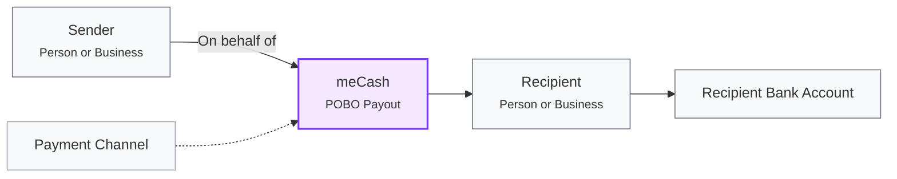

The **Pay on Behalf Of (POBO)** flow allows you to initiate cross-border payouts where the funds are explicitly sent on behalf of a distinct third party (the sender) to the final destination (the recipient).

In standard local payouts, your platform's workspace or wallet owner is implicitly assumed to be the sender. However, for international transfers, global compliance and Anti-Money Laundering (AML) regulations require strict identification of both the sending and receiving parties.



The flow represents the relationship between the parties:

* **Sender:** The person or business on whose behalf the payout is being made.
* **meCash POBO Payout:** Processes the payout using the specified quote and payment channel.
* **Recipient:** The final beneficiary receiving the funds.
* **Recipient Bank Account:** The account where the funds are delivered.
* **Payment Channel:** Determines how the payout is routed and, for applicable SWIFT transfers, how transfer charges are handled.

## Supported Corridors

POBO requires explicitly passing a `sender` object and is currently supported for:

* **US Dollar (USD):** To US bank accounts via SWIFT.
* **Euro (EUR):** To SEPA countries via Bank Transfer or SWIFT.

---

## The Sender Object

The `sender` object must map to the individual or business initiating the transfer on your platform.

### Sender Types

Set `sender.type` to accurately reflect the entity:

* `INDIVIDUAL` or `PERSON`: Use when the sender is a natural person.
* `BUSINESS`: Use when the sender is a registered company.

### Specific KYC Requirements

Depending on the corridor, specific sender fields are required:

**USD Payouts:**

* `icNumber`: Identification number of the sender.
* `mobileNumber`: International mobile number (e.g., `+234...`).

**EUR Payouts:**

* `dateOfIncorporation`: The business incorporation date (Required if `type` is `BUSINESS`).
* `relationship`: The sender's relationship to the account (e.g., `Self`).

---

## The Recipient Object

The `recipient` object must capture the final beneficiary receiving the funds.

Like the sender, you must define `recipient.type` as `INDIVIDUAL` (or `PERSON`) or `BUSINESS`. You must also provide international banking credentials:

* `swiftCode`: The BIC/SWIFT code (Required for USD).
* `accountNumber` or `iban`: The recipient's local account number or IBAN.

---

## Payment Channels & Fees

For cross-border POBO payouts, the `paymentChannel` must be provided at the **root level** of the JSON request.

### SWIFT Channels

For SWIFT payouts (USD and optionally EUR), you must specify who bears the transfer network fees:

| Channel             | Charge Bearer | Description                                                                                        |
| :------------------ | :------------ | :------------------------------------------------------------------------------------------------- |
| `SWIFT_CUSTOMER`    | Sender        | The sender bears all transfer charges. Your platform absorbs the full cost of the transfer.        |
| `SWIFT_SHARED`      | Both parties  | Charges are shared. The beneficiary receives a net amount after their portion of fees is deducted. |
| `SWIFT_BENEFICIARY` | Beneficiary   | The beneficiary bears all transfer charges.                                                        |

### SEPA Channels

For EUR transfers via SEPA, use `BANK_TRANSFER` as the payment channel.

---

## Constructing the Request

To initiate a POBO payout, you must link an active Quote to the transaction and pass both the `sender` and `recipient` blocks.

### Example: USD POBO (SWIFT)

```json
{
  "quoteId": "12f4e439-e000-436b-9706-98c4fc2b0486",
  "reason": "BUSINESS_INVOICE",
  "paymentChannel": "SWIFT_CUSTOMER",
  "currency": "USD",
  "sender": {
    "name": "Acme Corp",
    "type": "BUSINESS",
    "icNumber": "96671733919",
    "nationality": "NG",
    "mobileNumber": "+234872272808",
    "occupation": "SOFTWARE",
    "address": {
      "line1": "12 Tech Lane"
    }
  },
  "recipient": {
    "name": "Jane Smith",
    "type": "PERSON",
    "account": {
      "bankName": "Chase Bank",
      "accountNumber": "857362910",
      "swiftCode": "CHASUS33XXX"
    }
  }
}
```

### Example: EUR POBO (SEPA)

```json
{
  "quoteId": "59b19e8-8a00-4d59-9970-13f56",
  "reason": "Gift",
  "paymentChannel": "BANK_TRANSFER",
  "currency": "EUR",
  "sender": {
    "name": "John Doe",
    "type": "INDIVIDUAL",
    "relationship": "Self",
    "nationality": "NG",
    "occupation": "Engineer",
    "address": {
      "line1": "45 Lagos Road"
    }
  },
  "recipient": {
    "name": "Euro Trading LLC",
    "type": "BUSINESS",
    "country": "EU",
    "account": {
      "bankName": "Deutsche Bank",
      "bankCountry": "DE",
      "accountNumber": "123454354",
      "swiftCode": "DEUTDEDBXXX"
    }
  }
}
```

---

## Webhooks & Tracking

POBO payouts settle asynchronously over international networks (like SWIFT), which means they rarely succeed instantly.

1. **Initial Status:** A successful API response will return a `state` of `PENDING`.
2. **Tracking via API:** Use the [Get Transaction API](/transaction-docs/get-transaction) using the `referenceNumber` to poll the status.
3. **Webhooks:** The most reliable way to track completion is to subscribe to the [`payout.completed`](/webhook/payout-webhook) and [`payout.failed`](/webhook/payout-webhook) webhook events.

## Error Handling

If you misconfigure the POBO fields, you will likely encounter a `400 Bad Request` or `422 Unprocessable Entity`. Common validation errors include:

* Missing `sender` object for USD or EUR requests.
* Invalid `type` (Must be `INDIVIDUAL`, `PERSON`, or `BUSINESS`).
* Missing `paymentChannel` at the root of the request payload.
* Attempting to use a SWIFT channel for a destination that only supports `BANK_TRANSFER`.