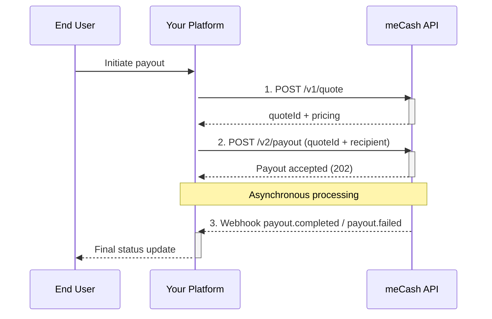

The **meCash Payout API** lets you send funds to recipients across multiple corridors. Every payout must reference a valid `quoteId`, ensuring the exchange rate, fees, and limits applied during quoting remain intact at execution time.

## Payout lifecycle

<Callout type="info" emoji="ℹ️">
  Subscribe to payout webhooks to receive reliable delivery and failure notifications. See [`webhooks-event`](/webhooks-event) for implementation details.
</Callout>

## Operational considerations

- **Quotes are mandatory**: Always create a quote first and reuse the `quoteId` during payout creation.
- **Idempotency**: Use client-generated references to safely retry payouts without double-paying.
- **Webhooks**: Treat the synchronous payout response as an acknowledgement. The final status arrives via webhook.
- **Compliance rules**: Review the `rules` array on the quote to enforce per-corridor limits in your UI.

## Next steps

- Create a payout with [`POST /v2/payout`](/payout-docs/create-payout).
- Explore corridor-specific payloads in [`payout docs examples`](/payout-docs/payout-examples/ngn-usd-example).
- Monitor disbursement states using the [`Get Transaction API`](/transaction-docs/get-transaction).
