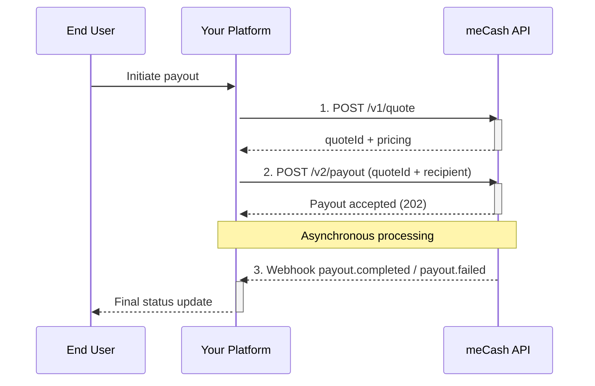

The **meCash Payout API** lets you send funds to recipients across multiple corridors. Every payout must reference a valid `quoteId`, ensuring the exchange rate, fees, and limits applied during quoting remain intact at execution time.

## Payout lifecycle

<Tip> Subscribe to payout webhooks to receive reliable delivery and failure notifications. See [`webhooks-event`](/webhooks-event) for implementation details.</Tip>

## Operational considerations

- **Quotes are mandatory**: Always create a quote first and reuse the `quoteId` during payout creation.
- **Idempotency**: Use client-generated references to safely retry payouts without double-paying.
- **Webhooks**: Treat the synchronous payout response as an acknowledgement. The final status arrives via webhook.
- **Compliance rules**: Review the `rules` array on the quote to enforce per-corridor limits in your UI.

## Payout API Routes

<CardGroup cols={3}>
  <Card title="🇳🇬 NGN → 🇳🇬 NGN" href="/payout-docs/payout-examples/ngn-ngn-example">
    Local-to-local naira payout with BVN checks and instant settlement.
  </Card>
  <Card title="🇳🇬 NGN → 🇺🇸 USD" href="/payout-docs/payout-examples/ngn-usd-example">
    Send naira to a US bank, covering FX, fees, and compliance steps.
  </Card>
  <Card title="🇳🇬 NGN → 🇪🇺 EUR" href="/payout-docs/payout-examples/ngn-eur-example">
    Move NGN funds into a euro account and handle required documents.
  </Card>
  <Card title="🇳🇬 NGN → 🇬🇧 GBP" href="/payout-docs/payout-examples/ngn-gbp-example">
    Walk through payouts to the UK and sort-code validation basics.
  </Card>
  <Card title="🇳🇬 NGN → 🇨🇦 CAD" href="/payout-docs/payout-examples/ngn-cad-example">
    Route NGN disbursements to Canada either via bank transfer or Interac.
  </Card>
  <Card title="🇲🇼 MWK → 🇲🇼 MWK" href="/payout-docs/payout-examples/mkw-mkw-example">
    Run domestic Malawi payouts and reuse saved recipients easily.
  </Card>
</CardGroup>

## Next steps

- Create a payout with [`POST /v2/payout`](/payout-docs/create-payout).
- Explore corridor-specific payloads with the example cards above or jump straight to the [`payout docs examples`](/payout-docs/payout-examples/ngn-usd-example).
- Monitor disbursement states using the [`Get Transaction API`](/transaction-docs/get-transaction).
