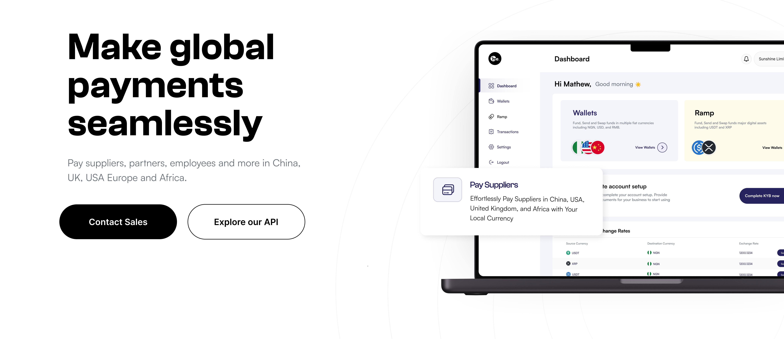
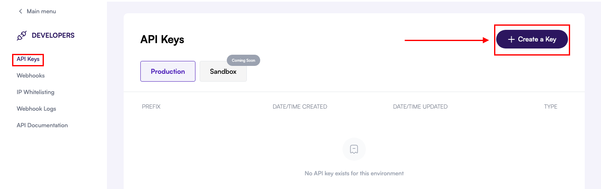
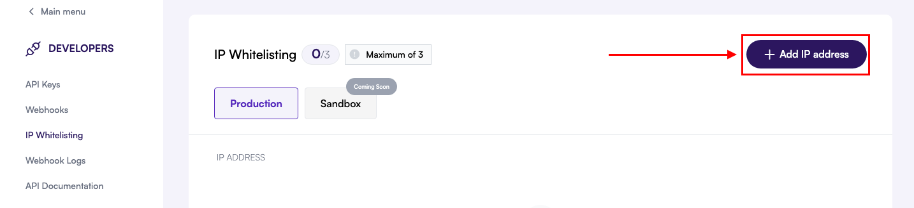
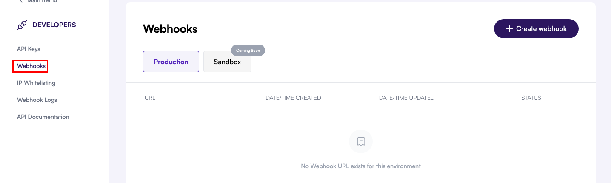
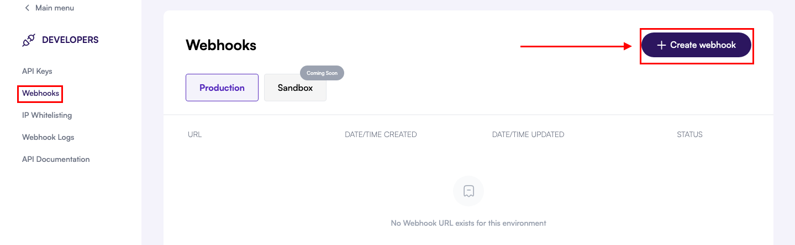
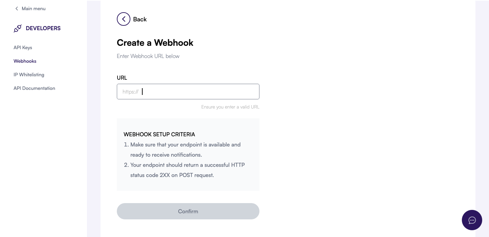

## Before you begin

Make sure you have:

- A registered [meCash Business](https://business.me-cash.com) account for your company.
- Legal and compliance documents handy (KYB form, director IDs, proof of address, BVN).
- A dedicated IP address or CIDR block for outbound traffic.
- A publicly reachable HTTPS endpoint that can receive webhook events.

## Get started with meCash API in 5 steps

Follow this quickstart guide to integrate meCash API into your application.

### Step 1: Create Your Account

<AccordionGroup>
  <Accordion icon="user-plus" title="Sign up for meCash Business">
    <Frame>
      
    </Frame>

    1. Visit [meCash Business](https://business.me-cash.com).
    2. Select **Sign Up**, complete the registration form, and set a strong password.
    3. Verify your email address to unlock the dashboard.
    4. Assign teammates under **Team Management** so they can collaborate.

  </Accordion>
  <Accordion icon="shield-check" title="Complete KYB Verification">
    - Fill out the KYB form in full—partial submissions delay approvals.
    - Upload clear copies of:
        - Business registration certificate
        - Valid government-issued ID for the business director
        - Recent proof of address (utility bill or bank statement)

    <Warning>The first and last name on the form must match the BVN you submit.</Warning>
  </Accordion>

  <Accordion icon="wallet" title="Activate your NGN virtual account">
    - Provide your BVN for account verification to unlock an NGN account.
    - Once approved, the account details appear under **Accounts → NGN**.

    <Tip>The BVN name must exactly match the first and last name submitted in KYB.</Tip>
  </Accordion>
</AccordionGroup>

### Step 2: Generate Your API Keys

<AccordionGroup>
  <Accordion icon="key" title="Create a sandbox API key">
    <Frame>
      
    </Frame>

    1. Log in to the meCash Business dashboard.
    2. Open **Developers → API Keys**.
    3. Confirm the **Sandbox** environment is selected, then click **Create a Key**.
    4. Label the key to match your environment and copy it to your secrets manager.

    <Tip>Never expose API keys in client-side code or public repos.</Tip>
  </Accordion>
  <Accordion icon="arrows-split" title="Environment Setup">
    From the dashboard you can toggle between the sandbox and production environments.
    The environment URLs are:
      - **Production**: `https://api.me-cash.com` - For live transactions.
      - **Sandbox**: `https://sandboxapi.me-cash.com` - For testing and development.

    <Note>Request a production key after KYB approval and final testing.</Note>
  </Accordion>
</AccordionGroup>

### Step 3: Configure Security

<Accordion icon="shield" title="IP Whitelisting">
  <Frame>
    
  </Frame>

  1. Go to **Developer** section in your dashboard.
  2. Navigate to **IP Whitelisting**.
  3. Add your outbound server IPs or CIDR ranges.
  4. Save the configuration.
  
  <Warning>Calls from non-whitelisted IPs are rejected automatically.</Warning>
</Accordion> 

### Step 4: Set up your webhook

<Accordion icon="gear" title="Configure Your Webhook in the Dashboard">
  <AccordionGroup>
    <Accordion icon="compass-drafting" title="Navigate to the Webhooks page">
      In the **Developers** section of your meCash dashboard, select **Webhooks** from the left-hand menu to review existing endpoints and create new ones.
      <Frame>
        
      </Frame>
    </Accordion>
    <Accordion icon="plus" title="Create a new webhook">
      Click the **Create Webhook** button at the top-right corner to launch the configuration modal for a new endpoint.
      <Frame>
        
      </Frame>
    </Accordion>
    <Accordion icon="link" title="Provide your webhook URL">
      - Enter the publicly accessible **URL** where you want to receive webhook events.<br />
      - Ensure the endpoint accepts HTTPS POST requests and responds within 10 seconds.<br />
      - Return an HTTP **2XX** status code to acknowledge receipt and prevent retries.
      <Frame>
        
      </Frame>
    </Accordion>
    <Accordion icon="circle-check" title="Confirm and monitor delivery">
      After clicking **Confirm**, your webhook appears in the list with its current status. Use the dashboard to pause, resume, rotate the signing secret, or trigger test events whenever you need a validation payload.
    </Accordion>
  </AccordionGroup>
</Accordion>


### Step 5: Make Your First API Call

<Accordion icon="code" title="Test API Connection">

  Start by listing wallets in the sandbox to confirm connectivity:

  ```bash title="List wallets in sandbox"
  export MCASH_API_KEY="YOUR_SANDBOX_API_KEY"

  curl -sS https://sandboxapi.me-cash.com/v1/wallets \
    -H "Content-Type: application/json" \
    -H "x-api-key: $MCASH_API_KEY"
  ```

  A successful call returns a `200` response with your available wallets:

  ```json title="Example response"
  {
    "data": [
      {
        "wallet_id": "WALLET-12345",
        "currency": "NGN",
        "balance": "0.00"
      }
    ]
  }
  ```

  <Tip>Keep sandbox and production keys separate. Rotate keys periodically via the dashboard.</Tip>
</Accordion>


## Next steps

Now that you have basic setup complete, explore these key features:

<CardGroup cols={2}>

<Card title="Create Quotes" icon="calculator" href="/quote/create-quote">
  Learn how to generate currency conversion quotes.
</Card>

<Card title="Process Payouts" icon="money-bill-transfer" href="/payout/create-payout">
  Send money to bank accounts and mobile wallets.
</Card>

<Card title="Manage Wallets" icon="wallet" href="/wallet/get-all-wallets">
  Create and manage multi-currency wallets.
</Card>

<Card title="Create Virtual Account" icon="account" href="/virtual-account-docs/about-virtual-account">
  Set up real-time transaction notifications.
</Card>

</CardGroup>

<Note>
  **Need help?** Contact us at [support@me-cash.com](mailto:support@me-cash.com) or join our [Discord community](https://discord.gg/CC5v6h52Wk).
</Note>
