The **meCash Quote API** returns a guaranteed exchange rate, fee breakdown, and settlement summary before you send money. Presenting this data to your users builds trust and prevents surprises when they confirm a payout.

<Tip> Every quote response contains a `quoteId`. You must send the same ID when creating a payout so the locked-in rate, fees, and rules are applied.</Tip>

## Quote lifecycle

When customers request a conversion, your platform should create a quote immediately. The flow below shows how the hand-off between your systems and meCash works.

```mermaid
sequenceDiagram
    participant User as End User
    participant Platform as Your Platform
    participant MeCash as meCash API

    User->>Platform: Request conversion (e.g. NGN → USD)
    activate Platform

    Platform->>MeCash: POST /v1/quote { amount, source, target }
    activate MeCash

    MeCash-->>Platform: quoteId, rate, fees, settlement info
    deactivate MeCash

    Platform-->>User: Display guaranteed amount + charges
    deactivate Platform
```

<Steps>
### User requests a rate
Collect the source amount, currency pair, and payment channel in your UI.
### Platform creates the quote
Send the data to `POST /v1/quote`. meCash evaluates limits, fees, and returns a `quoteId`.
### User confirms
Store the quote and prompt the user to continue to payout before it expires (`expiresInSeconds`).
</Steps>

  
Watch the in-product experience

  <Bleed full>
    <iframe
      src="public/images/meCash.mp4"
      width="100%"
      height="480px"
      title="meCash Quote flow demo"
    />
  </Bleed>

## What the response contains

- **Totals**: Exchange rate, fee breakdown, and target currency amount.
- **Rules**: Corridor limits and compliance requirements that applied.
- **Expiry**: `expiresInSeconds` tells you how long the quote remains valid. Quotes expire 10 minutes after creation unless otherwise stated in the response.

If the quote expires or fails validation, the payout endpoint returns an error. Refresh the quote and retry the payout with the new `quoteId`.

## Why quotes matter

- **Transparency**: Show the exact amount the recipient will receive before you debit the sender.
- **Compliance**: Respect corridor-specific rules, limits, and required disclosures.
- **User experience**: Prevent failed payouts by validating balances and rates upfront.

## Next steps
- Jump straight into the API Reference to inspect request and response schemas.
<CardGroup cols={2}>
  <Card title="Create Quote API" icon="code" href="/quote/create-quote">
    Review the full OpenAPI reference for `POST /v1/quote`, including schema details, example requests, and live testing.
  </Card>
  <Card title="Get Quote API" icon="search" href="/quote/get-quote">
    Fetch stored quotes via the API Reference entry for `GET /v1/quote/{quoteId}` and validate payload structures.
  </Card>
</CardGroup>
- Generate a quote programmatically with the [`Create Quote API`](/quote-docs/create-quote).
- Explore sample payloads in [`Create Quote examples`](/quote-docs/create-quote-all-examples).
- Retrieve an existing quote using the [`Get Quote API`](/quote-docs/get-quote) before completing a payout.
