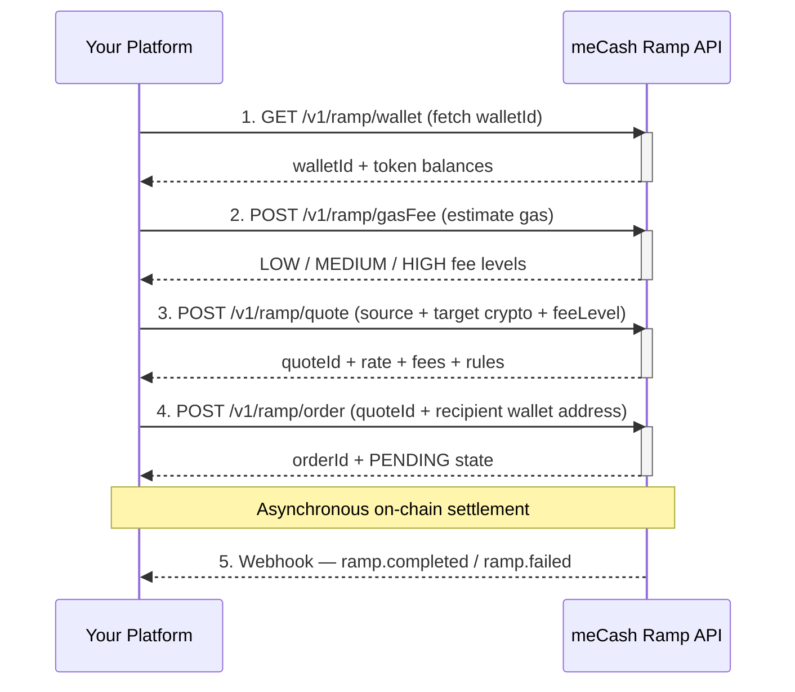
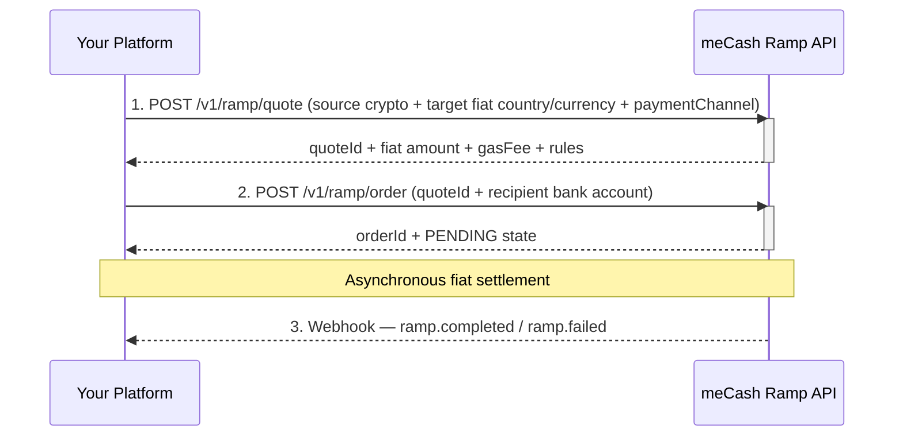

The **meCash Ramp API** lets you move value across the crypto–fiat boundary programmatically. There are two transaction categories:

- **Crypto-to-Crypto** — transfer a supported token (USDC, USDT, ETH) from your meCash wallet to any external blockchain address.
- **Offramp (Crypto-to-Fiat)** — convert crypto to a fiat currency (NGN, USD, EUR, GBP, CAD) and deliver it via bank transfer or mobile money.

Both flows share the same API shape: create a quote → execute a transaction → receive a webhook.

---

## Ramp API lifecycle

### Crypto-to-Crypto

### Offramp (Crypto-to-Fiat)

<Tip>
  Subscribe to ramp webhooks to receive reliable transaction outcome notifications. See the [Ramp Webhook Events](/webhook/ramp-webhook) for payload details.
</Tip>

---

## Operational considerations

- **Quotes expire**: Ramp quotes are valid for a limited window (~5–10 minutes). Always create a new quote if the previous one has expired before you call `/order`.
- **Gas fees are mandatory**: Crypto-to-crypto transfers require gas. Use the [Get Gas Fee](/quote-ramp/get-gas-fee) endpoint to present accurate fee options (LOW / MEDIUM / HIGH) to your users before quoting.
- **Offramp gas is included in the quote**: When you call [Create Quote (Offramp)](/quote-ramp/create-quote-offramp), the `gasFee` object is returned alongside the quote — no separate gas lookup is needed.
- **Check rules before executing**: The `rules` array on every quote response enforces per-corridor minimum and maximum limits. Validate these in your UI before allowing users to proceed.
- **Webhooks are the source of truth**: The `/order` response gives you an initial `PENDING` state. Treat it as an acknowledgement only. Final `COMPLETED` or `FAILED` status arrives asynchronously via webhook.
- **Fetch wallet balance first**: Use [Get Wallet Balance](/quote-ramp/get-wallet-balance) to confirm sufficient funds before creating a quote, especially for crypto-to-crypto transfers where gas is additive.

---

## Transaction states

| **State** | **Description** |
|-----------|-----------------|
| `PENDING` | Order accepted and queued for processing |
| `PROCESSING` | Transaction has been broadcast on-chain (crypto) or sent for bank settlement (offramp) |
| `COMPLETED` | Funds successfully delivered to the recipient |
| `FAILED` | Transaction failed — check the webhook payload for details |

---

## Ramp API routes

<CardGroup cols={2}>
  <Card title="Get Wallet Balance" icon="wallet" href="/quote-ramp/get-wallet-balance">
    Check available and pending token balances before initiating a transfer.
  </Card>
  <Card title="Get Gas Fee" icon="gas-pump" href="/quote-ramp/get-gas-fee">
    Estimate LOW / MEDIUM / HIGH gas fees for a crypto-to-crypto transfer.
  </Card>
  <Card title="Create Quote (Crypto)" icon="calculator" href="/quote-ramp/create-quote-crypto">
    Generate a quote for a crypto-to-crypto transfer with rate and fee breakdown.
  </Card>
  <Card title="Create Quote (Offramp)" icon="money-bill-transfer" href="/quote-ramp/create-quote-offramp">
    Generate a quote to convert crypto to fiat currency.
  </Card>
  <Card title="Get Quote (Crypto)" icon="magnifying-glass" href="/quote-ramp/get-quote-crypto">
    Retrieve details of a previously created crypto-to-crypto quote by ID.
  </Card>
  <Card title="Get Quote (Offramp)" icon="magnifying-glass-dollar" href="/quote-ramp/get-quote-offramp">
    Retrieve details of a previously created offramp quote by ID.
  </Card>
  <Card title="Create Transaction" icon="paper-plane" href="/quote-ramp/create-transaction">
    Execute a crypto or offramp transaction using a valid quoteId.
  </Card>
  <Card title="Get Transaction" icon="receipt" href="/quote-ramp/get-transaction">
    Fetch the full details and current state of a Ramp transaction.
  </Card>
</CardGroup>

---

## Next steps

- View all [supported assets and offramp destinations](/ramp-docs/supported-assets).
- Set up [Ramp Webhooks](/webhook/ramp-webhook) to track transaction outcomes in real time.
- Need dashboard instructions? See the [Ramp dashboard guides](/ramp-docs/ramp-overview) in Resources.
