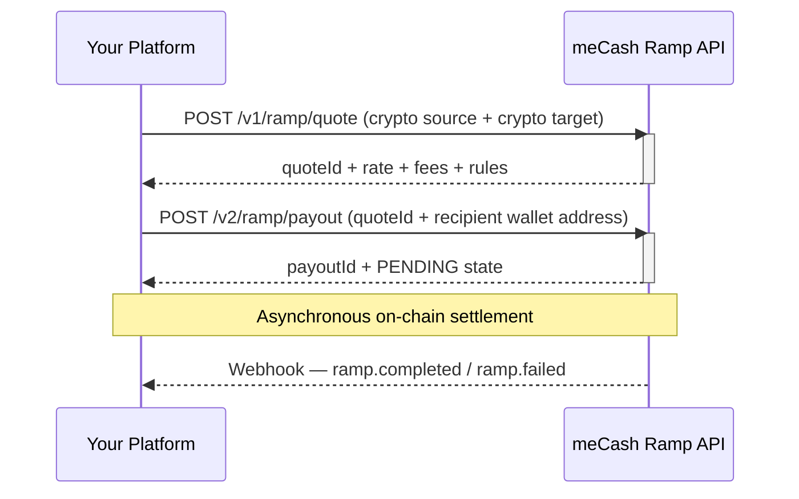
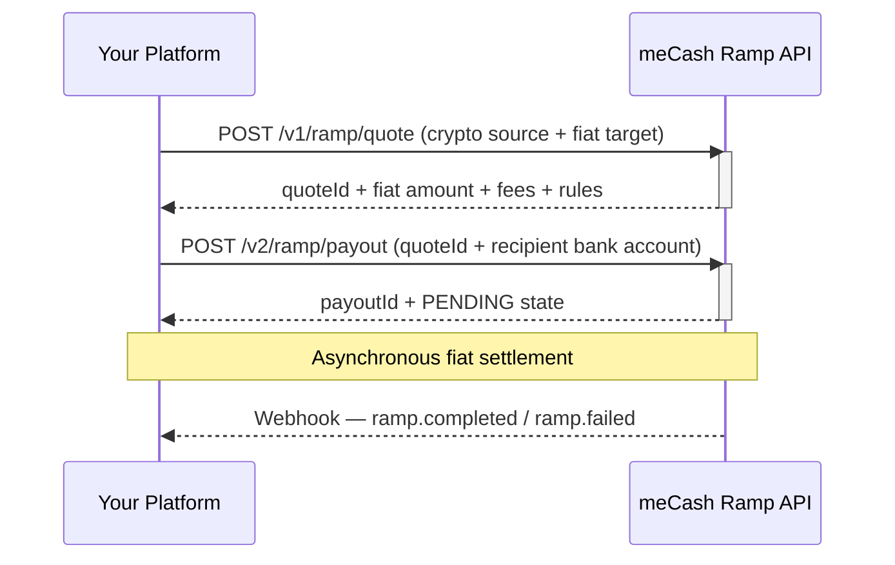
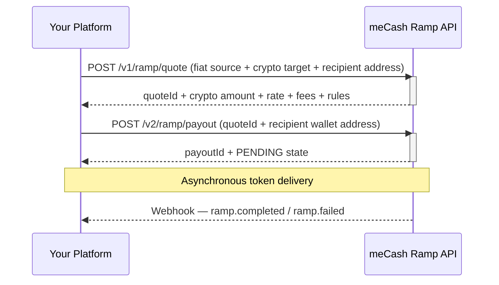

The **meCash Ramp API** lets you move value across crypto and fiat rails programmatically. All flows follow a two-step pattern:

1. **Create a Quote** — lock in rates, fees, and corridor limits.
2. **Execute a Payout** — consume the quote to deliver funds.

---

## Transaction categories

| **Category** | **Source** | **Target** | **Example** |
|---|---|---|---|
| **Crypto-to-Crypto** | USDC on Polygon Amoy | USDC on Polygon Amoy | Transfer stablecoins to an external wallet |
| **Offramp** (Crypto → Fiat) | USDC on Polygon Amoy | NGN via bank transfer | Convert crypto to naira and pay out to a Nigerian bank |
| **Onramp** (Fiat → Crypto) | NGN from Nigeria | USDT on Polygon Amoy | Buy crypto with local currency and receive tokens in a wallet |

---

## API lifecycle

### Step 1 — Create Quote

All three flows use a single unified endpoint:

```
POST {{baseURL}}/v1/ramp/quote
```

The request body shape changes based on the direction of the trade. See the dedicated pages:
- [Create Quote — Crypto-to-Crypto](/ramp-docs/ramp-quote-crypto)
- [Create Quote — Offramp (Crypto → Fiat)](/ramp-docs/ramp-quote-offramp)
- [Create Quote — Onramp (Fiat → Crypto)](/ramp-docs/ramp-quote-onramp)

The response always includes:
- A `quoteId` (`data.id`) — required for the next step.
- `rate`, `fee`, and `summary.total` — so your UI can display a breakdown.
- `rules` — corridor-level transaction limits to validate before payout.
- `settlement` — estimated delivery time.

### Step 2 — Execute Payout

Once you have a `quoteId`, execute the transfer:

```
POST {{baseURL}}/v2/ramp/payout
```

The `recipient` object changes based on whether the target is a blockchain wallet or a bank account. See the full guide:
- [Create Ramp Payout](/ramp-docs/ramp-payout)

---

## Sequence diagrams

### Crypto-to-Crypto



### Offramp (Crypto → Fiat)



### Onramp (Fiat → Crypto)



---

## Authentication

All Ramp API requests require the `x-api-key` header:

| **Header** | **Value** | **Required** |
|---|---|---|
| `Content-Type` | `application/json` | Yes |
| `x-api-key` | Your workspace API key | Yes |

See [Authentication](/authentication) for details on obtaining and rotating keys.

---

## Transaction states

| **State** | **Description** |
|---|---|
| `PENDING` | Order accepted and queued for processing |
| `PROCESSING` | Transaction broadcast on-chain (crypto) or sent for bank settlement (fiat) |
| `COMPLETED` | Funds successfully delivered to the recipient |
| `FAILED` | Transaction failed — check the webhook payload for details |

<Tip>
  Subscribe to [ramp webhooks](/webhook/webhook) to receive reliable transaction outcome notifications. The `/v2/ramp/payout` response is an acknowledgement only — treat webhooks as the source of truth.
</Tip>

---

## Environments

| **Environment** | **Base URL** |
|---|---|
| Sandbox | `https://sandboxapi.me-cash.com` |
| Production | `https://api.me-cash.com` |

<Warning>
  Use the sandbox environment for all testing. Production keys will process real transactions.
</Warning>

---

## Operational considerations

- **Quotes expire** — always create a new quote if the previous one has timed out.
- **Check rules before executing** — the `rules` array in every quote response contains per-corridor min/max limits. Validate in your UI before proceeding.
- **Webhooks are the source of truth** — the payout response gives an initial `PENDING` state. Final status arrives asynchronously via webhook.
- **Gas fees** — for crypto-to-crypto transfers, gas is included in the `fee` object. For offramp, gas is bundled into the quote.

---

## Quick links

<CardGroup cols={2}>
  <Card title="Create Quote (Crypto)" icon="coins" href="/ramp-docs/ramp-quote-crypto">
    Generate a quote for crypto-to-crypto transfers with rate and fee breakdown.
  </Card>
  <Card title="Create Quote (Offramp)" icon="money-bill-transfer" href="/ramp-docs/ramp-quote-offramp">
    Generate a quote to convert crypto to fiat currency.
  </Card>
  <Card title="Create Quote (Onramp)" icon="arrow-up-right-dots" href="/ramp-docs/ramp-quote-onramp">
    Generate a quote to convert fiat to cryptocurrency.
  </Card>
  <Card title="Create Ramp Payout" icon="paper-plane" href="/ramp-docs/ramp-payout">
    Execute a ramp transaction using a valid quoteId.
  </Card>
</CardGroup>

---

## Next steps

- View all [supported assets and offramp destinations](/ramp-docs/supported-assets).
- Set up [webhooks](/webhook/webhook) to track transaction outcomes in real time.
- Need dashboard instructions? See the [Ramp dashboard guides](/ramp-docs/ramp-overview) in Resources.
