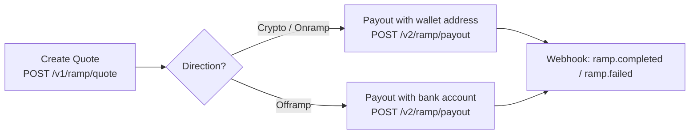

Use this endpoint to execute a ramp transaction. The payout consumes an existing `quoteId` from the [Create Quote](/ramp-docs/ramp-api-overview) step and delivers funds to the specified recipient — either a blockchain wallet address or a bank account.

<Tip>
  **Two-step flow:** You must first create a quote via `POST /v1/ramp/quote`, then execute it with this endpoint. See the [Ramp API Overview](/ramp-docs/ramp-api-overview) for the full lifecycle.
</Tip>

## Endpoint

**POST** `{{baseURL}}/v2/ramp/payout`


---

## Request headers

| **Header** | **Value** | **Required** | **Description** |
|---|---|---|---|
| `Content-Type` | `application/json` | Yes | Specifies that the request body is JSON. |
| `x-api-key` | `YOUR_API_KEY` | Yes | API key for authentication. |

---

## Request body — Crypto / Onramp payout

Use this payload shape when executing a **crypto-to-crypto transfer** or an **onramp (fiat-to-crypto)** transaction. The recipient is a blockchain wallet address.

```json copy
{
    "recipient": {
        "address": "0xd62acd62fdb155afaa5d12c6caf01119d413dfd9",
        "blockchain": "MATIC"
    },
    "quoteId": "318f21d8-2dd1-4321-b218-881fbdb64484",
    "reason": "Gift",
    "remark": "Checking"
}
```

### Body fields (Crypto / Onramp)

| **Field** | **Type** | **Required** | **Description** |
|---|---|---|---|
| `recipient.address` | string | Yes | External wallet address where crypto will be delivered. |
| `recipient.blockchain` | string | Yes | Blockchain network for the recipient wallet (e.g. `MATIC`). |
| `quoteId` | string | Yes | Quote identifier returned from `POST /v1/ramp/quote`. |
| `reason` | string | Yes | Purpose of the transaction (e.g. `Gift`, `Salary`, `Payment`). |
| `remark` | string | No | Additional notes or reference. |

---

## Request body — Offramp (Bank payout)

Use this payload shape when executing an **offramp (crypto-to-fiat)** transaction. The recipient is a bank account.

```json copy
{
    "recipient": {
        "name": "Pastor Bright",
        "account": {
            "bankName": "Access Bank",
            "sortCode": "045",
            "accountNumber": "0690000032"
        },
        "paymentChannel": "BANK_TRANSFER",
        "currency": "NGN",
        "country": "NG"
    },
    "quoteId": "108e2f2d-be85-4a49-93c8-333dd5746124",
    "reason": "Gift",
    "remark": "Checking"
}
```

### Body fields (Offramp)

| **Field** | **Type** | **Required** | **Description** |
|---|---|---|---|
| `recipient.name` | string | Yes | Full name of the beneficiary. |
| `recipient.account.bankName` | string | Yes | Financial institution name (e.g. `Access Bank`). |
| `recipient.account.sortCode` | string | Yes | Bank sort code or routing code. |
| `recipient.account.accountNumber` | string | Yes | Destination bank account number. |
| `recipient.paymentChannel` | string | Yes | Delivery channel (e.g. `BANK_TRANSFER`). |
| `recipient.currency` | string | Yes | ISO 4217 fiat currency code (e.g. `NGN`). |
| `recipient.country` | string | Yes | ISO 3166-1 alpha-2 country code (e.g. `NG`). |
| `quoteId` | string | Yes | Quote identifier returned from `POST /v1/ramp/quote`. |
| `reason` | string | Yes | Purpose of the transaction. |
| `remark` | string | No | Additional notes or reference. |

---

## Request examples

### Crypto / Onramp payout

<CodeGroup>
```bash cURL
curl --request POST '{{baseURL}}/v2/ramp/payout' \
  --header 'x-api-key: YOUR_API_KEY' \
  --header 'Content-Type: application/json' \
  --data '{
    "recipient": {
        "address": "0xd62acd62fdb155afaa5d12c6caf01119d413dfd9",
        "blockchain": "MATIC"
    },
    "quoteId": "318f21d8-2dd1-4321-b218-881fbdb64484",
    "reason": "Gift",
    "remark": "Checking"
  }'
```
```js JavaScript (fetch)
const payload = {
  recipient: {
    address: '0xd62acd62fdb155afaa5d12c6caf01119d413dfd9',
    blockchain: 'MATIC'
  },
  quoteId: '318f21d8-2dd1-4321-b218-881fbdb64484',
  reason: 'Gift',
  remark: 'Checking'
};

fetch('{{baseURL}}/v2/ramp/payout', {
  method: 'POST',
  headers: {
    'x-api-key': 'YOUR_API_KEY',
    'Content-Type': 'application/json'
  },
  body: JSON.stringify(payload)
})
  .then((res) => {
    if (!res.ok) throw new Error(`Request failed with status ${res.status}`);
    return res.json();
  })
  .then((body) => console.log(body))
  .catch((error) => console.error('Failed to create payout', error));
```
```python Python (requests)
import requests

url = "{{baseURL}}/v2/ramp/payout"
headers = {
    "x-api-key": "YOUR_API_KEY",
    "Content-Type": "application/json",
}
payload = {
    "recipient": {
        "address": "0xd62acd62fdb155afaa5d12c6caf01119d413dfd9",
        "blockchain": "MATIC",
    },
    "quoteId": "318f21d8-2dd1-4321-b218-881fbdb64484",
    "reason": "Gift",
    "remark": "Checking",
}

response = requests.post(url, json=payload, headers=headers, timeout=30)
response.raise_for_status()
print(response.json())
```
```js Node.js (axios)
const axios = require('axios');

axios.post('{{baseURL}}/v2/ramp/payout', {
  recipient: {
    address: '0xd62acd62fdb155afaa5d12c6caf01119d413dfd9',
    blockchain: 'MATIC'
  },
  quoteId: '318f21d8-2dd1-4321-b218-881fbdb64484',
  reason: 'Gift',
  remark: 'Checking'
}, {
  headers: {
    'x-api-key': 'YOUR_API_KEY',
    'Content-Type': 'application/json'
  },
  timeout: 30000
})
  .then((response) => console.log(response.data))
  .catch((error) => {
    if (error.response) {
      console.error('API error:', error.response.data);
    } else {
      console.error('Request error:', error.message);
    }
  });
```
</CodeGroup>

### Offramp (Bank) payout

<CodeGroup>
```bash cURL
curl --request POST '{{baseURL}}/v2/ramp/payout' \
  --header 'x-api-key: YOUR_API_KEY' \
  --header 'Content-Type: application/json' \
  --data '{
    "recipient": {
        "name": "Pastor Bright",
        "account": {
            "bankName": "Access Bank",
            "sortCode": "045",
            "accountNumber": "0690000032"
        },
        "paymentChannel": "BANK_TRANSFER",
        "currency": "NGN",
        "country": "NG"
    },
    "quoteId": "108e2f2d-be85-4a49-93c8-333dd5746124",
    "reason": "Gift",
    "remark": "Checking"
  }'
```
```js JavaScript (fetch)
const payload = {
  recipient: {
    name: 'Pastor Bright',
    account: {
      bankName: 'Access Bank',
      sortCode: '045',
      accountNumber: '0690000032'
    },
    paymentChannel: 'BANK_TRANSFER',
    currency: 'NGN',
    country: 'NG'
  },
  quoteId: '108e2f2d-be85-4a49-93c8-333dd5746124',
  reason: 'Gift',
  remark: 'Checking'
};

fetch('{{baseURL}}/v2/ramp/payout', {
  method: 'POST',
  headers: {
    'x-api-key': 'YOUR_API_KEY',
    'Content-Type': 'application/json'
  },
  body: JSON.stringify(payload)
})
  .then((res) => {
    if (!res.ok) throw new Error(`Request failed with status ${res.status}`);
    return res.json();
  })
  .then((body) => console.log(body))
  .catch((error) => console.error('Failed to create offramp payout', error));
```
```python Python (requests)
import requests

url = "{{baseURL}}/v2/ramp/payout"
headers = {
    "x-api-key": "YOUR_API_KEY",
    "Content-Type": "application/json",
}
payload = {
    "recipient": {
        "name": "Pastor Bright",
        "account": {
            "bankName": "Access Bank",
            "sortCode": "045",
            "accountNumber": "0690000032",
        },
        "paymentChannel": "BANK_TRANSFER",
        "currency": "NGN",
        "country": "NG",
    },
    "quoteId": "108e2f2d-be85-4a49-93c8-333dd5746124",
    "reason": "Gift",
    "remark": "Checking",
}

response = requests.post(url, json=payload, headers=headers, timeout=30)
response.raise_for_status()
print(response.json())
```
```js Node.js (axios)
const axios = require('axios');

axios.post('{{baseURL}}/v2/ramp/payout', {
  recipient: {
    name: 'Pastor Bright',
    account: {
      bankName: 'Access Bank',
      sortCode: '045',
      accountNumber: '0690000032'
    },
    paymentChannel: 'BANK_TRANSFER',
    currency: 'NGN',
    country: 'NG'
  },
  quoteId: '108e2f2d-be85-4a49-93c8-333dd5746124',
  reason: 'Gift',
  remark: 'Checking'
}, {
  headers: {
    'x-api-key': 'YOUR_API_KEY',
    'Content-Type': 'application/json'
  },
  timeout: 30000
})
  .then((response) => console.log(response.data))
  .catch((error) => {
    if (error.response) {
      console.error('API error:', error.response.data);
    } else {
      console.error('Request error:', error.message);
    }
  });
```
</CodeGroup>

---

## Transaction states

After a successful payout request, the transaction enters a `PENDING` state. Monitor state transitions via webhooks:

| **State** | **Description** |
|---|---|
| `PENDING` | Payout accepted and queued for processing. |
| `PROCESSING` | Transaction broadcast on-chain (crypto) or sent for bank settlement (fiat). |
| `COMPLETED` | Funds successfully delivered to the recipient. |
| `FAILED` | Transaction failed — check the webhook payload for error details. |

<Tip>
  **Webhooks are the source of truth.** The payout response confirms acceptance only. Subscribe to [webhook events](/webhook/webhook) to receive final `COMPLETED` or `FAILED` status.
</Tip>

---

## Error responses

| **Status** | **Error Code** | **Message** | **Description** |
|---|---|---|---|
| 400 | `INVALID_INPUT` | Invalid request payload | Required fields are missing or formatted incorrectly. |
| 400 | `INVALID_INPUT` | Insufficient wallet balance | Wallet cannot cover the transaction amount. |
| 401 | `UNAUTHORIZED` | Missing or invalid API key | The `x-api-key` header is missing or incorrect. |
| 403 | `FORBIDDEN` | Access denied: IP not whitelisted | Request from a non-whitelisted IP address. |
| 404 | `NOT_FOUND` | Endpoint not found | Verify you are calling `POST /v2/ramp/payout`. |
| 422 | `QUOTE_EXPIRED` | Stale quote | The quote has expired. Create a fresh quote and retry. |
| 422 | `INVALID_QUOTE` | Invalid quote ID | The quoteId is invalid or already consumed. |
| 500 | `SERVER_ERROR` | Internal server error | An unexpected error occurred. Retry with backoff. |

---

## Best practices

- **Always create a fresh quote** if the previous one has expired before calling payout.
- **Validate recipient details** — for offramp, use the [Account Enquiry](/miscellaneous/perform-account-enquiry) endpoint to verify bank account details before submitting.
- **Implement idempotency** — use unique references to safely retry without duplicating transactions.
- **Listen to webhooks** — do not poll the API for status. Subscribe to [webhook events](/webhook/webhook) for real-time updates.
- **Handle errors gracefully** — check the `rules` array in the quote response for corridor limits before calling payout.

---

## Integration flow summary



---

## Next steps

- [Create Quote (Crypto)](/ramp-docs/ramp-quote-crypto) — generate a crypto-to-crypto quote.
- [Create Quote (Offramp)](/ramp-docs/ramp-quote-offramp) — generate a crypto-to-fiat quote.
- [Create Quote (Onramp)](/ramp-docs/ramp-quote-onramp) — generate a fiat-to-crypto quote.
- [Supported Assets & Destinations](/ramp-docs/supported-assets) — see all available tokens, blockchains, and fiat corridors.
