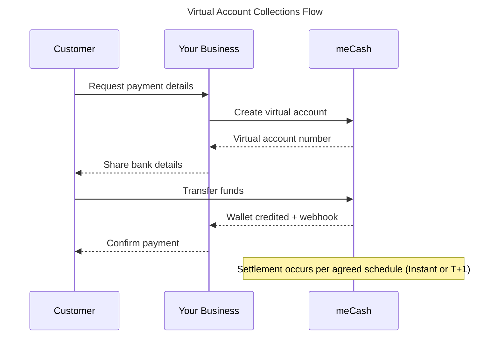

Virtual accounts give your business bank account numbers that map directly to your meCash wallet. 
Assign them to customers, collect payments via standard transfers, and reconcile everything from a single ledger.

## Supported currencies

| Currency | Code | Status |
|----------|------|---------|
| Nigerian Naira | NGN 🇳🇬 | Available |
| Malawian Kwacha | MWK 🇲🇼 | Available |

> 📋 **More currencies coming soon** - We're continuously expanding to new corridors. Check your dashboard or our release notes for the latest updates.

## 💳 Account Types

### Static Virtual Accounts
**Ideal for**: Recurring payments, long-term customers, and subscription services.

**Key features**:
- **Permanent account numbers** that never expire.
- **Accept multiple deposits** from the same customer.
- **Perfect for ongoing business relationships** .
- **Simplified customer experience** with consistent payment details.

### Dynamic Virtual Accounts  
**Ideal for**: One-time invoices, time-bound campaigns, and specific payment scenarios.

**Key features**:
- **Dual-constraint design** - controlled by both time and amount parameters.
- **Time-driven expiration** - auto-expires after your set duration.
- **Amount-driven closure** - automatically closes once the exact payment amount is received.
- **Enhanced security** for controlled payment scenarios.
- **Perfect for invoice payments and campaign collections**.

## ⚡ Settlement Options

| Option | Description | Ideal Use Cases |
|--------|-------------|-----------------|
| **Instant** | Funds are credited to your wallet immediately after successful payment | • Real-time cash flow • Just-in-time fulfillment • Urgent payment processing |
| **T+1** | Funds settle to your wallet on the next business day | • Batch accounting • Easier reconciliation • Scheduled financial operations |

## How the flow works

<Steps>
### Generate a virtual account
Call the static or dynamic endpoint (or use the dashboard) to issue a bank account number tied to your wallet.
### Share details with your customer
Provide the account name and number so they can pay you through their preferred banking channel.
### Collect the transfer
Incoming funds credit your wallet automatically; you receive a webhook for each deposit.
### Reconcile and settle
Monitor balances in your wallet, and optionally sweep funds to bank accounts according to your settlement schedule.
</Steps>

## Next steps

- Issue a permanent account with the [`Create Static Virtual Account`](/virtual-accounts-docs/static-virtual-account) guide.
- Generate time-bound accounts for campaigns in [`Create Dynamic Virtual Account`](/virtual-accounts-docs/dynamic-virtual-account).
- Retrieve account details with [`Get Virtual Account`](/virtual-accounts-docs/get-virtual-account).
