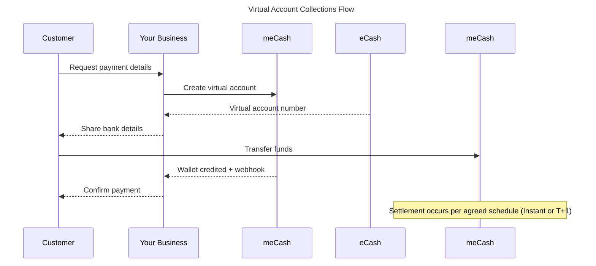

Virtual accounts give your business bank account numbers that map directly to your meCash wallet. 
Assign them to customers, collect payments via standard transfers, and reconcile everything from a single ledger.

## Supported currencies

| Currency | Code | Status |
|----------|------|---------|
| Nigerian Naira | NGN 🇳🇬 | Available |
| Malawian Kwacha | MWK 🇲🇼 | Available |

> 📋 **More currencies coming soon** - We're continuously expanding to new corridors. Check your dashboard or our release notes for the latest updates.

## 💳 Account Types

### Static Virtual Accounts
**Ideal for**: Recurring payments, long-term customers, and subscription services.

**Key features**:
- **Permanent account numbers** that never expire.
- **Accept multiple deposits** from the same customer.
- **Perfect for ongoing business relationships** .
- **Simplified customer experience** with consistent payment details.

### Dynamic Virtual Accounts  
**Ideal for**: One-time invoices, time-bound campaigns, and specific payment scenarios.

**Key features**:
- **Dual-constraint design** - controlled by both time and amount parameters.
- **Time-driven expiration** - auto-expires after your set duration.
- **Amount-driven closure** - automatically closes once the exact payment amount is received.
- **Enhanced security** for controlled payment scenarios.
- **Perfect for invoice payments and campaign collections**.

## ⚡ Settlement Options
- **Instant** : Funds are credited to your wallet immediately after successful payment. It is useful for real-time cash flow, just-in-time fulfillment, and urgent payment processing.
- **T+1** : Funds settle to your wallet on the next business day. It is easier reconciliation and Scheduled financial operations.

## How the flow works

<AccordionGroup>
  <Accordion icon="1-circle" title="Generate a virtual account">
    Call the static or dynamic endpoint to issue a bank account number tied to your wallet.
  </Accordion>
  <Accordion icon="2-circle" title="Share payment details">
    Provide the account name and number so customers can pay through their preferred banking channel.
  </Accordion>
  <Accordion icon="3-circle" title="Collect the transfer">
    Incoming funds credit your wallet automatically. You also receive a webhook for each deposit.
  </Accordion>
  <Accordion icon="4-circle" title="Reconcile and settle">
    Monitor wallet balances, then sweep funds to your bank per your instant or T+1 settlement schedule.
  </Accordion>
</AccordionGroup>

## Next steps

- Issue a permanent account with the [`Create Static Virtual Account`](/virtual-accounts-docs/static-virtual-account) guide.
- Generate time-bound accounts for campaigns in [`Create Dynamic Virtual Account`](/virtual-accounts-docs/dynamic-virtual-account).
- Retrieve account details with [`Get Virtual Account`](/virtual-accounts-docs/get-virtual-account).
