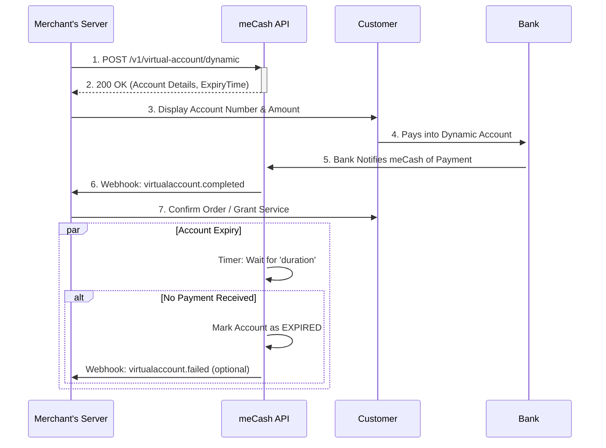

Dynamic accounts are short-lived, one-time-use bank account numbers. They are designed to streamline payments by ensuring the funds received match a specific, expected amount. They automatically expire after a time limit you define.

This is ideal for invoicing, one-time checkouts, or any scenario where you need to tie a payment directly to a specific transaction.

### **Supported Corridors**
meCash Dynamic accounts currently support: 
- **Nigeria (NGN)**
- **Malawi (MKW)**

## How it Works: The Transaction Flow

This diagram shows the complete lifecycle of a dynamic virtual account, from creation to successful payment.



## Common Use Cases

Dynamic accounts are highly effective for managing one-to-one payments.

- **E-commerce Checkouts**: Generate a unique account for every customer's cart. This provides a secure, one-time payment channel and simplifies reconciliation, as each successful payment maps directly to an order.

- **Invoice Payments**: When issuing an invoice to a client, attach a dynamic account for the exact invoice amount. You'll get an instant webhook when it's paid, automating your accounts receivable.

- **Event Ticketing**: Create a unique account for each ticket reservation. The account can expire after 15 minutes, automatically releasing the ticket back into the pool if not paid.

- **Top-ups & Credits**: Assign a dynamic account for a user's wallet top-up request. Once paid, you can be certain the funds are for that specific user and credit their wallet automatically.


<CardGroup cols={1}>
  <Card title="API Reference: Create Dynamic Virtual Account" icon="code" href="/virtual-account/create-dynamic-virtual-account">
    Explore the API Reference for `POST /v1/virtual-account/dynamic`, including schema definitions and testing tools.
  </Card>
</CardGroup>

## Request examples

### Custom naming behavior

If you provide a `accountName`, the same string is applied to the newly created dynamic account. When the field is not supplied, we automatically use the workspace’s registered business name.

<CodeGroup>
```json Request
{
  "currency": "NGN",
  "country": "NG",
  "amount": 150,
  "duration": 30,
  "reference": "TXN_REF_DYNAMIC_12345678",
  "accountName": "Spar Ikorodu"
}
```
```json Response
{
    "message": "virtual account created successfully",
    "status": "success",
    "data": {
        "id": "96f466d3-13b0-4b7d-a0ea-bae189b31b15",
        "firstName": "Spar Ikorodu",
        "lastName": "Spar Ikorodu",
        "email": "N/A",
        "reference": "TXN_REF_DYNAMIC_12345678",
        "account": {
            "name": "Spar Ikorodu",
            "bankName": "FCMB MFB",
            "sortCode": "090409",
            "number": "999012XXXX"
        },
        "status": "ACTIVE",
        "currency": "NGN",
        "country": "NG",
        "isPermanent": false,
        "expiryTime": 1762854326863,
        "created": "2025-11-11T09:35:26.863769692Z"
    }
}

```
</CodeGroup>

<Note> When expiry time elapses, `data.status` changes to `INACTIVE` </Note>

### Standard currency-specific examples

<CodeGroup>
```bash Nigeria (NGN)
curl --request POST '{{baseURL}}/v1/virtual-account/dynamic' \
  --header 'x-api-key: YOUR_API_KEY' \
  --header 'Content-Type: application/json' \
  --data '{
    "currency": "NGN",
    "country": "NG",
    "amount": 5000,
    "duration": 30,
    "reference": "TXN_REF_DYNAMIC_12345678"
    "accountName": "Spar Ikorodu"
  }'
```
```bash Malawi (MWK)
curl --request POST '{{baseURL}}/v1/virtual-account/dynamic' \
  --header 'x-api-key: YOUR_API_KEY' \
  --header 'Content-Type: application/json' \
  --data '{
    "currency": "MWK",
    "country": "MW",
    "amount": 10000,
    "duration": 45,
    "reference": "TXN_REF_DYNAMIC_98765432"
    
  }'
```
</CodeGroup>

## Successful response

```json copy
{
    "message": "virtual account created successfully",
    "status": "success",
    "data": {
        "id": "96f466d3-13b0-4b7d-a0ea-xxxxxxxxxxxxx",
        "firstName": "Spar Ikorodu",
        "lastName": "Spar Ikorodu",
        "email": "N/A",
        "reference": "TXN_REF_DYNAMIC_12345678",
        "account": {
            "name": "Spar Ikorodu",
            "bankName": "FCMB MFB",
            "sortCode": "090409",
            "number": "999012XXXX"
        },
        "status": "ACTIVE",
        "currency": "NGN",
        "country": "NG",
        "isPermanent": false,
        "expiryTime": 1762854326863,
        "created": "2025-11-11T09:35:26.863769692Z"
    }
}
```

### Response fields

| Field | Type | Description |
|-------|------|-------------|
| message | string | Operation status message |
| status | string | API request status |
| data | object | Virtual account details container |
| data.id | string | Unique identifier for the virtual account |
| data.firstName | string | Name passed during creation |
| data.lastName | string | Name passed during creation |
| data.email | string | Account email address |
| data.reference | string | Transaction reference number |
| data.account | object | Bank account details object |
| data.account.name | string | Name on the bank account |
| data.account.bankName | string | Name of the bank |
| data.account.sortCode | string | Bank sort code |
| data.account.number | string | Virtual account number |
| data.status | string | Status of the virtual account|
| data.currency | string | Currency code (NGN) |
| data.country | string | Country code (NG) |
| data.isPermanent | boolean | Either `true` or `false` depending on the account type. Always `false` for Dynamic accounts  |
| data.expiryTime | number | Account expiry timestamp in milliseconds |
| data.created | string | Account creation timestamp in ISO format |

## Error responses

| Status | Message | Cause | How to fix |
|--------|---------|-------|-----------|
| 400 | `Invalid Payload` | Payload validation failed or fields are improperly formatted. | Double-check required keys (`amount`, `duration`, `reference`, etc.) and data types before sending. |
| 400 | `Duration must be an integer` | `duration` is missing or not an integer. | Pass duration as an integer that represents minutes (e.g., `30`). |
| 401 | `API key missing or incorrect` | `x-api-key` header is absent, invalid, or expired. | Supply a valid API key for the environment you are calling. |
| 409 | `Reference must be unique` | The `reference` already exists from a previous request. | Reuse the previous response or generate a brand-new reference. |
| 500 | `Service temporarily unavailable` | Internal server issue or downtime. | Retry later; open a ticket if the problem persists. |

## Webhooks

Payments to the dynamic account trigger webhooks:

- `virtualaccount.completed` — deposit succeeded and the wallet was credited.
- `virtualaccount.failed` — payment attempt failed or expired.

Check [`webhooks-event`](/webhooks-event) for payload schemas and signature verification instructions.

## Best practices

- Pass `accountName` when you need customer-facing labeling (campaigns, store fronts). Skip it to fall back to your registered business name automatically.
- Use a unique `reference` per transaction to keep your ledger idempotent.
- Expire accounts as soon as the invoice is paid by deleting or ignoring them once you receive the webhook.
- Display a countdown timer in your UI using the `expiryTime` so payers know when the account will close.
