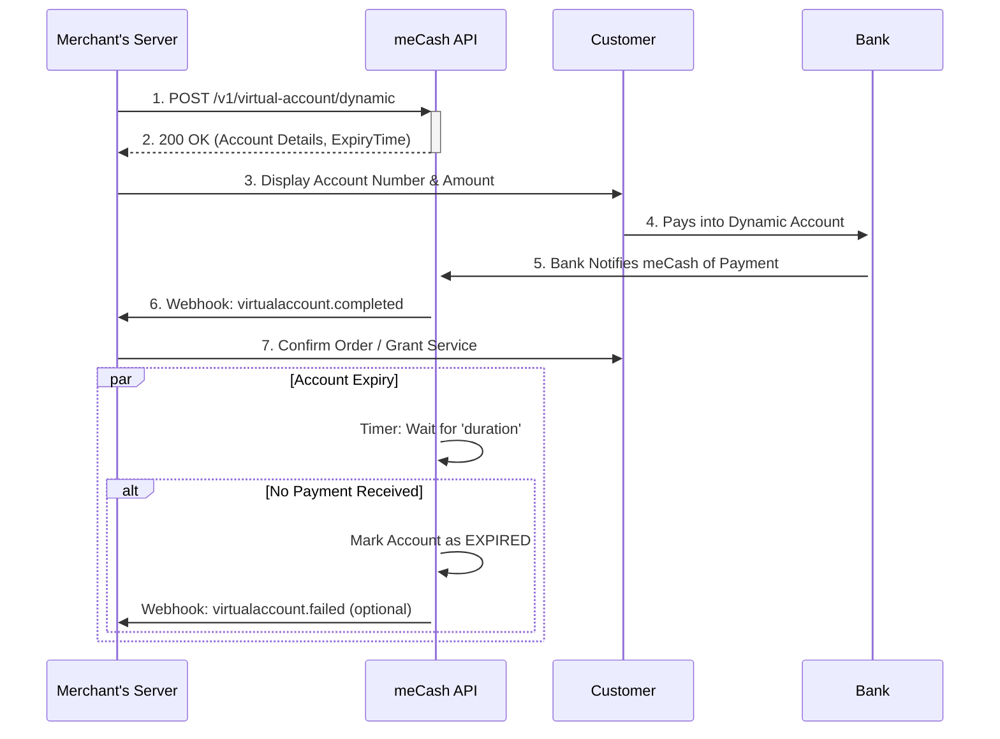

Dynamic accounts are short-lived, one-time-use bank account numbers. They are designed to streamline payments by ensuring the funds received match a specific, expected amount. They automatically expire after a time limit you define.

This is ideal for invoicing, one-time checkouts, or any scenario where you need to tie a payment directly to a specific transaction.

### **Supported Corridors**
meCash Dynamic accounts currently support: 
- **Nigeria (NGN)**
- **Malawi (MKW)**

## How it Works: The Transaction Flow

This diagram shows the complete lifecycle of a dynamic virtual account, from creation to successful payment.



## Common Use Cases

Dynamic accounts are highly effective for managing one-to-one payments.

- **E-commerce Checkouts**: Generate a unique account for every customer's cart. This provides a secure, one-time payment channel and simplifies reconciliation, as each successful payment maps directly to an order.

- **Invoice Payments**: When issuing an invoice to a client, attach a dynamic account for the exact invoice amount. You'll get an instant webhook when it's paid, automating your accounts receivable.

- **Event Ticketing**: Create a unique account for each ticket reservation. The account can expire after 15 minutes, automatically releasing the ticket back into the pool if not paid.

- **Top-ups & Credits**: Assign a dynamic account for a user's wallet top-up request. Once paid, you can be certain the funds are for that specific user and credit their wallet automatically.


<CardGroup cols={1}>
  <Card title="API Reference: Create Dynamic Virtual Account" icon="code" href="/virtual-account/create-dynamic-virtual-account">
    Explore the API Reference for `POST /v1/virtual-account/dynamic`, including schema definitions and testing tools.
  </Card>
</CardGroup>

## Request examples

### Custom naming behavior

If you provide an `accountName`, the same string is applied to the newly created dynamic account. When the field is not supplied, we automatically use the workspace’s registered business name.

<CodeGroup>
```json Request
{
  "currency": "NGN",
  "country": "NG",
  "amount": 150,
  "duration": 30,
  "reference": "errfjgrrhvke",
  "accountName": "Spar Ikorodu"
}
```
```json Response
{
  "status": "SUCCESS",
  "data": {
    "noOfSuccessfulVirtualAccountCreation": 1,
    "successfulVirtualAccounts": [
      {
        "payload": {
          "durationInMinutes": "30",
          "transactionAmount": "150",
          "transactionReference": "errfjgrrhvke"
        },
        "virtualAccountNumber": "9990106443",
        "virtualAccountName": "Spar Ikorodu"
      }
    ]
  },
  "message": "success"
}
```
</CodeGroup>

### Standard currency-specific examples

<CodeGroup>
```bash Nigeria (NGN)
curl --request POST '{{baseURL}}/v1/virtual-account/dynamic' \
  --header 'x-api-key: YOUR_API_KEY' \
  --header 'Content-Type: application/json' \
  --data '{
    "currency": "NGN",
    "country": "NG",
    "amount": 5000,
    "duration": 30,
    "reference": "TXN_REF_DYNAMIC_12345678"
    "accountName": "Ikoko VI"
  }'
```
```bash Malawi (MWK)
curl --request POST '{{baseURL}}/v1/virtual-account/dynamic' \
  --header 'x-api-key: YOUR_API_KEY' \
  --header 'Content-Type: application/json' \
  --data '{
    "currency": "MWK",
    "country": "MW",
    "amount": 10000,
    "duration": 45,
    "reference": "TXN_REF_DYNAMIC_98765432"
    "accountName": "Spar Malawi"
  }'
```
</CodeGroup>

## Successful response

```json copy
{
  "message": "virtual account created successfully",
  "status": "success",
  "data": {
    "id": "30fe4022-09da-46fb-bafa-xxxxxxxxxxxxx",
    "reference": "TXN_REF_DYNAMIC_12345678",
    "account": {
      "bankName": "Sterling Bank",
      "sortCode": null,
      "number": "8817835350",
      "name": "Spar Ikorodu"
    },
    "expiryTime": 30,
    "status": "ACTIVE",
    "currency": "NGN",
    "country": "NG",
    "created": "2025-06-26T17:46:11.636Z"
  }
}
```

### Response fields

| Field | Type | Description |
|-------|------|-------------|
| `data.account.number` | String | Virtual account number customers will fund. |
| `data.account.name` | String | Echoes the `accountName` you supplied (or your registered business name when the field was omitted). |
| `data.expiryTime` | Number | Unix timestamp (seconds) when the account expires. |
| `data.status` | String | Account status; becomes `EXPIRED` after the duration elapses. |
| `data.reference` | String | Echo of the idempotency reference you sent. |

## Error responses

| Status | Meaning | Example message | How to fix |
|--------|---------|-----------------|-----------|
| 400 | Invalid request. | `Invalid request payload` | Confirm `amount`, `duration`, and required fields are present. |
| 401 | Authentication failed. | `Invalid API key` | Verify the `x-api-key` and environment. |
| 409 | Duplicate reference. | `reference already exists` | Reuse the previous response or provide a new reference. |
| 422 | Amount mismatch. | `Amount must be greater than zero` | Provide a positive number. |
| 500 | Server error. | `Server failed to process request.` | Retry later or contact support if persistent. |

## Webhooks

Payments to the dynamic account trigger webhooks:

- `virtualaccount.completed` — deposit succeeded and the wallet was credited.
- `virtualaccount.failed` — payment attempt failed or expired.

Check [`webhooks-event`](/webhooks-event) for payload schemas and signature verification instructions.

## Best practices

- Pass `accountName` when you need customer-facing labeling (campaigns, store fronts). Skip it to fall back to your registered business name automatically.
- Use a unique `reference` per transaction to keep your ledger idempotent.
- Expire accounts as soon as the invoice is paid by deleting or ignoring them once you receive the webhook.
- Display a countdown timer in your UI using the `expiryTime` so payers know when the account will close.
