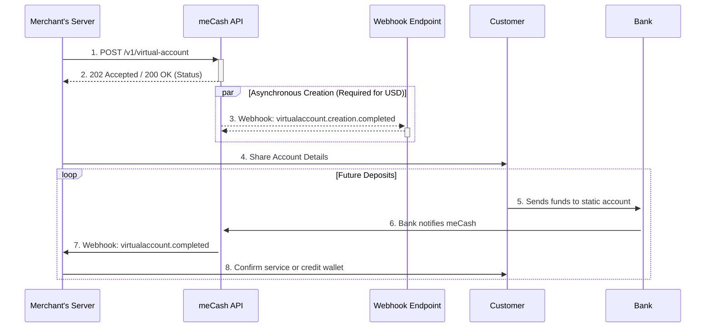

Static accounts provide a permanent bank account number that routes funds into your meCash wallet. They are ideal for customers who pay you multiple times, high-value partners that need a fixed destination, or payout streams you want to reconcile to a single account.

Unlike dynamic accounts, static accounts never expire. Once issued, the same account number can be shared across invoices, embedded in your CRM, or stored by customers for repeat transfers.

### **Supported Corridors**

meCash static accounts currently support:

- **Nigeria (NGN)** 🇳🇬
- **Malawi (MWK)** 🇲🇼
- **United States (USD)** 🇺🇸 — [View USD Virtual Account documentation](/virtual-accounts-docs/usd-virtual-account)

## How it Works: The Transaction Flow

This flow shows how a static account is created once and reused for every subsequent payment.



<Note>
**Asynchronous Processing**: For certain currencies like USD, the virtual account creation is asynchronous. The API will initially return a `PROCESSING` status, and the final account details (Account Number, SWIFT Code) will be sent to your webhook URL via the `virtualaccount.creation.completed` event.
</Note>

## Common Use Cases

- **Recurring Customers**: Assign one static account per enterprise buyer so every top-up, milestone payment, or retainer routes to the same reference, simplifying ledger reconciliation.

- **Corporate Collections**: Provide each branch or franchise with a dedicated account and observe inflows per unit without opening new bank accounts manually.

- **Agency & Field Operations**: Issue static accounts to agents in the field so they can collect deposits locally while you maintain centralized visibility.

- **Offline Channels**: Publish the account number on invoices, websites, or signage. Customers can re-use it without requesting a fresh account each time.

<CardGroup cols={1}>
  <Card title="API Reference: Create Static Virtual Account" icon="code" href="/virtual-account/create-virtual-account">
    Jump to the OpenAPI entry for `POST /v1/virtual-account` to review schema details, example requests, and live playground access.
  </Card>
</CardGroup>


### Standard Currency-specific Request Examples

<CodeGroup>
```bash Nigeria (NGN)
curl --request POST '{{baseURL}}/v1/virtual-account' \
  --header 'x-api-key: YOUR_API_KEY' \
  --header 'Content-Type: application/json' \
  --data '{
    "currency": "NGN",
    "country": "NG",
    "firstName": "Jumoke",
    "lastName": "Dumebi",
    "email": "example@email.com",
    "phoneNumber": "+23481345XXXX",
    "bvn": "12345678901",
    "reference": "000023456X",
    "accountName": "Jumoke Dumebi"
  }'
```
```bash Malawi (MWK)
curl --request POST '{{baseURL}}/v1/virtual-account' \
  --header 'x-api-key: YOUR_API_KEY' \
  --header 'Content-Type: application/json' \
  --data '{
    "currency": "MWK",
    "country": "MW",
    "firstName": "Corrine",
    "lastName": "Schinner",
    "email": "kathl@example.com",
    "phoneNumber": "+265813XXXXXX",
    "reference": "000033556X",
    "accountName": "Kathleen Langosh"
  }'
```
</CodeGroup>

<Info>
For USD Virtual Accounts, see the dedicated [USD Virtual Account documentation](/virtual-accounts-docs/usd-virtual-account).
</Info>


## Standard currency-specific Response Examples

<CodeGroup>
```json Nigeria (NGN)
{
  "message": "virtual account created successfully",
  "status": "success",
  "data": {
    "id": "e21f7365-4fc9-4669-a9d9-xxxxxxxxxxxxx",
    "firstName": "Jumoke",
    "lastName": "Dumebi",
    "email": "example@email.com",
    "phoneNumber": "+234813456XXXXX",
    "reference": "000033556X",
    "account": {
      "name": "Jumoke Dumebi",
      "bankName": "Mock Bank",
      "sortCode": null,
      "number": "881725XXXXX"
    },
    "status": "ACTIVE",
    "currency": "NGN",
    "country": "NG",
    "created": "2025-05-15T13:39:57.405Z"
  }
}
```

```json Malawi (MWK)
{
  "message": "virtual account created successfully",
  "status": "success",
  "data": {
    "id": "e21f7365-4fc9-4669-a9d9-xxxxxxxxxxxxx",
    "firstName": "Corrine",
    "lastName": "Schinner",
    "email": "kathl@example.com",
    "phoneNumber": "+265813XXXXXX",
    "reference": "000033556X",
    "account": {
      "name": "Corrine Schinner",
      "bankName": "Mock Bank",
      "sortCode": null,
      "number": "881725XXXXX"
    },
    "status": "ACTIVE",
    "currency": "MWK",
    "country": "MW",
    "created": "2025-05-15T13:39:57.405Z"
  }
}
```
</CodeGroup>


<TabGroup>
<Tab title="Nigeria (NGN)">

| **Field** | **Type** | **Description** |
|-------|------|-------------|
| `message` | String | Operation status message. |
| `status` | String | API request status. |
| `data` | Object | Container for the virtual account properties. |
| `data.id` | String | Identifier for the virtual account resource. |
| `data.firstName` | String | Customer first name supplied in the request. |
| `data.lastName` | String | Customer last name supplied in the request. |
| `data.email` | String | Contact email tied to the account. |
| `data.phoneNumber` | String | Phone number stored for the customer. |
| `data.reference` | String | Unique identifier you provided for idempotency. |
| `data.account.name` | String | Display name on the bank account. |
| `data.account.bankName` | String | Issuing bank for the virtual account. |
| `data.account.sortCode` | String | Bank sort code when available; `null` otherwise. |
| `data.account.number` | String | Account number customers will fund. |
| `data.status` | String | Account status (`ACTIVE`, `SUSPENDED`, etc.). |
| `data.currency` | String | ISO 4217 currency code (`NGN`, `MWK`). |
| `data.country` | String | ISO 3166-1 alpha-2 country code (`NG`, `MW`). |
| `data.created` | String | ISO 8601 timestamp when the account was created. |

</Tab>

<Tab title="Malawi (MWK)">

| **Field** | **Type** | **Description** |
|-------|------|-------------|
| `message` | String | Operation status message. |
| `status` | String | API request status. |
| `data` | Object | Container for the virtual account properties. |
| `data.id` | String | Identifier for the virtual account resource. |
| `data.firstName` | String | Customer first name supplied in the request. |
| `data.lastName` | String | Customer last name supplied in the request. |
| `data.email` | String | Contact email tied to the account. |
| `data.phoneNumber` | String | Phone number stored for the customer. |
| `data.reference` | String | Unique identifier you provided for idempotency. |
| `data.account.name` | String | Display name on the bank account. |
| `data.account.bankName` | String | Issuing bank for the virtual account. |
| `data.account.sortCode` | String | Bank sort code when available; `null` otherwise. |
| `data.account.number` | String | Account number customers will fund. |
| `data.status` | String | Account status (`ACTIVE`, `SUSPENDED`, etc.). |
| `data.currency` | String | ISO 4217 currency code (`NGN`, `MWK`). |
| `data.country` | String | ISO 3166-1 alpha-2 country code (`NG`, `MW`). |
| `data.created` | String | ISO 8601 timestamp when the account was created. |

</Tab>

<Tab title="USD (USD)">

| **Field** | **Type** | **Description** |
|-------|------|-------------|
| `message` | String | Operation status message. |
| `status` | String | API request status. |
| `data` | Object | Container for the virtual account properties. |
| `data.id` | String | Identifier for the virtual account resource. |
| `data.firstName` | String | Authorized representative's first name. |
| `data.lastName` | String | Authorized representative's last name. |
| `data.email` | String | Contact email tied to the account. |
| `data.phoneNumber` | String | Phone number stored for the customer. |
| `data.reference` | String | Unique identifier you provided for idempotency. |
| `data.accountName` | String | Display name for the account (Business Name). |
| `data.gender` | String | Gender of the representative (`M` or `F`). |
| `data.dateOfBirth` | String | Date of birth (YYYY-MM-DD). |
| `data.nationality` | String | 2-letter ISO country code of nationality. |
| `data.idType` | String | Type of identification provided (e.g., `PASSPORT`). |
| `data.idNumber` | String | Unique ID number from the document (masked in response). |
| `data.address` | String | Street address. |
| `data.city` | String | City or Town. |
| `data.postalCode` | String | Zip or Postal code. |
| `data.account.name` | String | Display name on the bank account. |
| `data.account.bankName` | String | Issuing bank for the virtual account. |
| `data.account.sortCode` | String | Bank sort code. |
| `data.account.number` | String | Account number customers will fund. |
| `data.account.swiftCode` | String | SWIFT code for international transfers. |
| `data.status` | String | Account status (`ACTIVE`, `SUSPENDED`, etc.). |
| `data.currency` | String | ISO 4217 currency code (`USD`). |
| `data.country` | String | ISO 3166-1 alpha-2 country code (`US`). |
| `data.isPermanent` | Boolean | Whether the account is permanent (always `true` for static accounts). |
| `data.created` | String | ISO 8601 timestamp when the account was created. |
| `data.company` | Object | Company registration details. |
| `data.company.registrationNumber` | String | Business registration number provided during creation. |
| `data.company.registrationCountry` | String | 2-letter ISO country code where the company is registered. |
| `data.company.registrationDate` | String | Date of company registration (YYYY-MM-DD). |

</Tab>

</TabGroup>

## Error responses

| **Status** | **Message** | **Cause** | **How to fix** |
|--------|---------|-------|-----------|
| 400 | `Invalid country or currency ISO code` | Country or currency combination is not supported. | Pass a valid ISO 3166 country + ISO 4217 currency pair. |
| 400 | `Phone number must include valid country code` | `phoneNumber` is not in international format. | Send E.164 numbers such as `+2348XXXXXXX`. |
| 400 | `Request JSON malformed or missing required fields` | Payload is missing mandatory properties or contains invalid JSON. | Validate required keys (`currency`, `country`, `reference`, etc.) before sending. |
| 400 | `BVN is required` | `bvn` was omitted for a corridor where it is mandatory (e.g., NGN). | Provide an 11-digit BVN when creating Nigerian virtual accounts. |
| 401 | `API key missing or incorrect` | `x-api-key` header is absent, expired, or wrong environment. | Include the correct workspace API key for the target environment. |
| 409 | `Reference must be unique` | The `reference` has already been used in a previous request. | Reuse the original response or send a fresh unique reference. |
| 500 | `Service temporarily unavailable` | Temporary backend/database failure. | Retry with exponential backoff or contact support if it persists. |

## Best practices

- Store the `reference` and response payload so you can reuse the virtual account without additional API calls.
- Mask the BVN and other PII when logging requests to comply with data-protection policies.
- Pair this endpoint with [`Get Virtual Account`](/virtual-accounts-docs/get-virtual-account) to confirm account details before displaying them to a customer.
- Subscribe to `virtualaccount.completed` webhooks so you reconcile deposits the moment they land.
