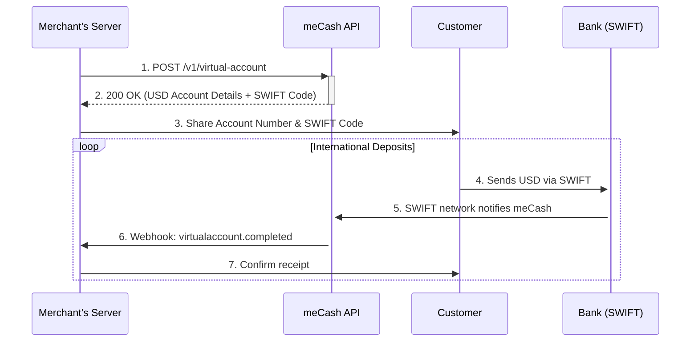

USD Virtual Accounts allow you to receive US Dollar payments directly into your meCash wallet via SWIFT transfers. These accounts are ideal for businesses that need to collect international payments in USD.

<Note>
**Sales Approval Required**: USD Virtual Accounts require prior approval. Please [contact Sales](https://sales.me-cash.com) to request access before attempting to create a USD virtual account.
</Note>

## Key Features

- **Permanent Account**: Once created, your USD virtual account remains active indefinitely
- **SWIFT Enabled**: Receive international wire transfers via SWIFT
- **Business-Ready**: Designed for corporate collections with company registration requirements
- **Global Reach**: Accept USD payments from anywhere in the world

## Prerequisites

Before creating a USD Virtual Account, ensure you have:

1. **Sales Approval**: Contact [Sales](https://sales.me-cash.com) to enable USD virtual accounts for your workspace
2. **Company Registration Details**: You'll need your business registration number, country, and date
3. **KYC Information**: Valid identification for the authorized representative

## How it Works



## Request Fields

| **Field** | **Type** | **Required** | **Description** |
|-----------|----------|--------------|-----------------|
| `currency` | String | Yes | Must be `USD` |
| `country` | String | Yes | Must be `US` |
| `firstName` | String | Yes | Authorized representative's first name |
| `lastName` | String | Yes | Authorized representative's last name |
| `email` | String | Yes | Contact email address |
| `phoneNumber` | String | Yes | Phone number in international format |
| `reference` | String | Yes | Your unique reference for idempotency |
| `accountName` | String | Yes | Business/account display name |
| `gender` | String | Yes | Gender of representative (`M` or `F`) |
| `dateOfBirth` | String | Yes | Date of birth (YYYY-MM-DD format) |
| `nationality` | String | Yes | 2-letter ISO country code |
| `idType` | String | Yes | Type of ID (e.g., `PASSPORT`, `NATIONAL_ID`) |
| `idNumber` | String | Yes | ID document number |
| `address` | String | Yes | Street address |
| `city` | String | Yes | City or town |
| `postalCode` | String | Yes | Postal/ZIP code |
| `company` | Object | Yes | Company registration details |
| `company.registrationNumber` | String | Yes | Business registration number |
| `company.registrationCountry` | String | Yes | 2-letter ISO country code where company is registered |
| `company.registrationDate` | String | Yes | Date of registration (YYYY-MM-DD format) |

## Request Example

```bash
curl --request POST '{{baseURL}}/v1/virtual-account' \
  --header 'x-api-key: YOUR_API_KEY' \
  --header 'Content-Type: application/json' \
  --data '{
  "currency": "USD",
  "country": "US",
  "firstName": "John",
  "lastName": "Mary",
  "email": "someone@gmail.com",
  "phoneNumber": "+2348156936458",
  "reference": "REF_8899562444KLLTTPL90",
  "accountName": "Test Ng Ltd",
  "gender": "M",
  "dateOfBirth": "1980-10-10",
  "nationality": "NG",
  "idType": "PASSPORT",
  "idNumber": "C234567890",
  "address": "Brown Way",
  "city": "Lagos",
  "postalCode": "100001",
  "company": {
    "registrationNumber": "NG1235687",
    "registrationCountry": "NG",
    "registrationDate": "2024-10-10"
  }
}'
```

## Response Example

```json
{
    "message": "virtual account created successfully",
    "status": "success",
    "data": {
        "id": "d03dbb81-331b-4834-844c-35c91ff30ad6",
        "firstName": "John",
        "lastName": "Mary",
        "email": "someone@gmail.com",
        "phoneNumber": "+2348156936458",
        "reference": "REF_8899562444KLLTTPL90",
        "accountName": "Test Ng Ltd",
        "gender": "M",
        "dateOfBirth": "1980-10-10",
        "nationality": "NG",
        "idType": "PASSPORT",
        "idNumber": "C********0",
        "address": "Brown Way",
        "city": "Lagos",
        "postalCode": "100001",
        "account": {
            "name": "Test Ng Ltd",
            "bankName": "DBS Bank Limited",
            "sortCode": "MOOLAHGO",
            "number": "584784577026",
            "swiftCode": "DBSSSGSGXXX"
        },
        "status": "ACTIVE",
        "currency": "USD",
        "country": "US",
        "isPermanent": true,
        "created": "2025-12-02T14:01:22.417190608Z",
        "company": {
            "registrationNumber": "NG1235687",
            "registrationCountry": "NG",
            "registrationDate": "2024-10-10"
        }
    }
}
```

## Response Fields

| **Field** | **Type** | **Description** |
|-----------|----------|-----------------|
| `message` | String | Operation status message |
| `status` | String | API request status |
| `data.id` | String | Unique identifier for the virtual account |
| `data.firstName` | String | Authorized representative's first name |
| `data.lastName` | String | Authorized representative's last name |
| `data.email` | String | Contact email tied to the account |
| `data.phoneNumber` | String | Phone number stored for the customer |
| `data.reference` | String | Your unique reference for idempotency |
| `data.accountName` | String | Display name for the account (Business Name) |
| `data.gender` | String | Gender of the representative (`M` or `F`) |
| `data.dateOfBirth` | String | Date of birth (YYYY-MM-DD) |
| `data.nationality` | String | 2-letter ISO country code of nationality |
| `data.idType` | String | Type of identification provided |
| `data.idNumber` | String | ID number (masked in response) |
| `data.address` | String | Street address |
| `data.city` | String | City or Town |
| `data.postalCode` | String | Postal/ZIP code |
| `data.account.name` | String | Display name on the bank account |
| `data.account.bankName` | String | Issuing bank for the virtual account |
| `data.account.sortCode` | String | Bank sort code |
| `data.account.number` | String | Account number for receiving funds |
| `data.account.swiftCode` | String | SWIFT/BIC code for international transfers |
| `data.status` | String | Account status (`ACTIVE`, `SUSPENDED`, etc.) |
| `data.currency` | String | ISO 4217 currency code (`USD`) |
| `data.country` | String | ISO 3166-1 alpha-2 country code (`US`) |
| `data.isPermanent` | Boolean | Always `true` for USD virtual accounts |
| `data.created` | String | ISO 8601 timestamp when the account was created |
| `data.company` | Object | Company registration details |
| `data.company.registrationNumber` | String | Business registration number |
| `data.company.registrationCountry` | String | Country where company is registered |
| `data.company.registrationDate` | String | Date of company registration |

## Sharing Account Details

When sharing the account details with your customers for SWIFT transfers, provide:

1. **Account Number**: The `account.number` field
2. **Bank Name**: The `account.bankName` field
3. **SWIFT/BIC Code**: The `account.swiftCode` field
4. **Account Name**: The `account.name` field

<Tip>
Always include the SWIFT code when sharing account details for international transfers. This ensures funds are routed correctly.
</Tip>

## Error Responses

| **Status** | **Message** | **Cause** | **How to Fix** |
|------------|-------------|-----------|----------------|
| 400 | `USD virtual accounts not enabled` | Your workspace doesn't have USD virtual accounts enabled | Contact [Sales](https://sales.me-cash.com) to request access |
| 400 | `Company registration details required` | Missing `company` object in request | Include all required company registration fields |
| 400 | `Invalid company registration country` | Invalid ISO country code in `company.registrationCountry` | Use a valid 2-letter ISO country code |
| 400 | `Invalid date format` | Incorrect date format for `dateOfBirth` or `registrationDate` | Use YYYY-MM-DD format |
| 401 | `API key missing or incorrect` | Invalid or missing API key | Include correct `x-api-key` header |
| 409 | `Reference must be unique` | The `reference` has been used before | Use a unique reference value |

## Webhooks

When funds are deposited into your USD virtual account, you'll receive a `virtualaccount.completed` webhook. See [USD Virtual Account Webhook](/webhook/usd-virtualaccount-webhook) for payload details.

## Best Practices

- **Store Account Details**: Save the response so you can share the account number and SWIFT code without additional API calls
- **Use Unique References**: Always provide a unique `reference` for each virtual account creation request
- **Verify Company Details**: Ensure company registration details are accurate to avoid delays
- **Monitor Webhooks**: Subscribe to `virtualaccount.completed` events to track incoming deposits in real-time

<CardGroup cols={2}>
  <Card title="API Reference" icon="code" href="/virtual-account/create-virtual-account">
    View the OpenAPI specification for creating virtual accounts
  </Card>
  <Card title="USD Webhook Events" icon="bell" href="/webhook/usd-virtualaccount-webhook">
    Learn about USD virtual account webhook payloads
  </Card>
</CardGroup>
